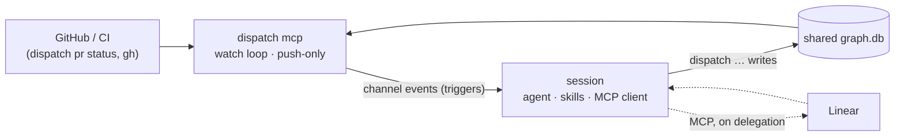

# Design: the CLI as a channel — pushing events into a live session

This design makes the `dispatch` CLI available over MCP as a **Claude Code
channel**, moves the polling loops out of the skills and into the CLI, and lets
the CLI push events — "refresh the graph", "start ticket X", "CI finished on
PR 7" — back into the session that is doing the work.

It supersedes the cold-spawn daemon model in §3.1. Once accepted, §3.1 is
reframed around the channel server described here (see
[Relationship to §3.1](#relationship-to-31)).

## Motivation

Today every wait is a foreground loop the agent runs itself:

- `deliver` **is** a poll loop — `sleep` + `pr-status` re-reads until a PR
  merges, explicitly forbidding `Monitor` and background loops because the
  armed-monitor wake "observably fails on long polls."
- `orchestrate` ticks once per `/loop` firing, re-reading `dispatch graph
  summary` every 1–30 minutes.
- `work-ticket` and `milestone-review` lazily poll tracker threads and
  heartbeat their claims.

The agent burns a turn — and context — sitting in `sleep`. A review that lands
in ten seconds is noticed on the next five-minute tick. The cadence is guesswork
encoded in skill markdown, per skill, with no shared view of what is actually
worth waking for.

The waiting is deterministic infrastructure; the reacting is judgment. This
repo's rule is that determinism belongs in the CLI. Waiting is determinism the
CLI does not yet own.

## Goals

- The CLI holds the waits. The session is woken only when there is something to
  react to.
- Skills stop containing poll loops. `deliver` and `orchestrate` become **event
  handlers**, not loops — while keeping a non-channel fallback (see
  [Channel mode vs fallback mode](#channel-mode-vs-fallback-mode)).
- The CLI decides cadence once, centrally, with the dynamic intervals §3.1
  already specifies — not scattered across skills.
- Preserve the trust boundary: the CLI never gains an MCP client; the session
  keeps it. MCP-only work is delegated back to the session, not pulled into the
  CLI.
- Keep the session's write path unchanged: the session still acts through
  ordinary `dispatch …` commands against the shared SQLite graph, which is also
  how it signals the server.
- Support the concurrency the CLI already allows: multiple sessions working
  different projects at once, without stepping on each other (see
  [Multi-session](#multi-session-many-orchestrators-one-database)).

## Non-goals

- A token/REST tracker adapter. The delegation pattern removes the need for one:
  the session's existing MCP client does tracker work when asked.
- Two-way channel features beyond push — reply tools and permission relay. The
  first cut is push-only; session→server signalling rides the shared DB. These
  stay available as a later option if DB-poll latency proves too slow.

## Background: what a channel is

A [Claude Code channel](https://code.claude.com/docs/en/channels) is an MCP
server that Claude Code spawns as a **stdio subprocess** and that can *push*
events into the running session. The server declares
`capabilities.experimental['claude/channel']: {}` and emits
`notifications/claude/channel` with `{ content, meta }`. The event lands in the
session as a tag:

```text
<channel source="dispatch" kind="ci_finished" repo="o/r" pr="7" rollup="failure">
…pr-status payload…
</channel>
```

`content` is the tag body; each `meta` key becomes an attribute (values are
always strings). Events **queue**: several pushed while the agent is busy arrive
once it is free, each as its own turn, in order. A channel can be push-only
(notifications) or also expose MCP tools; this design uses push-only.

### Constraints to design within

Channels come with several constraints. None is fatal; each shapes a specific
decision.

| Constraint                    | Consequence for this design                                                        |
| ----------------------------- | ---------------------------------------------------------------------------------- |
| Server, not client (no MCP)   | The watch loop can't reach MCP-only sources (Linear); that work is delegated back to the session, which has the MCP client. |
| Session-scoped lifetime       | Each session spawns its own server; the server lives and dies with it. Always-on = a persistent interactive session (see [Measured behavior of the preview](#measured-behavior-of-the-preview)). |
| Not always available          | Research preview (flags/protocol may change; custom channels need `--dangerously-load-development-channels`, and so an interactive session until the plugin is allowlisted), Anthropic-auth only (no Bedrock / Vertex / Foundry), org `channelsEnabled` gate. The skills therefore need a non-channel fallback mode. |
| Injected content              | Event bodies enter the agent's context; the body is the same `dispatch pr status` payload the agent already consumes, so its trust properties are unchanged (see [Injection safety](#injection-safety)). |

The no-MCP boundary is the most interesting of these — it's what makes
delegation a load-bearing pattern rather than a convenience — but it is one
constraint among several, not the whole design.

### Measured behavior of the preview

A throwaway stdio server that declares the capability and pushes
`notifications/claude/channel` was driven from real sessions on Claude Code
2.1.218 (Anthropic auth, personal Max org). Delivery works. The rest of this
subsection is what those sessions did, except where it is marked as read from the
runner's source instead — a distinction worth keeping, since source-read details
can change under us without a session ever behaving differently. Where any of it
contradicts the paragraphs above, it wins.

**Delivery.** An event arrives as a user-role message in its own turn:

```text
<channel source="channel-probe" kind="probe" seq="1" repo="ianwremmel/agentic" pr="0">
hand-emitted probe event: if you can read this, delivery works
</channel>
```

`source` is the MCP server name, injected by the runner. Events pushed while the
session is busy queue on the same inbound queue as task notifications and are
delivered in order as separate turns once the current turn ends. The channel
layer never merges two events, so all coalescing is the server's job.

**Gates, in the order the runner applies them.** Each produces a `skip` with a
named kind; the first one that trips wins.

| # | Gate                                       | Skip kind    | Observed here                 |
| - | ------------------------------------------ | ------------ | ----------------------------- |
| 1 | server declares the capability             | `capability` | passes                        |
| 2 | first-party auth (no third-party provider) | `provider`   | passes                        |
| 3 | feature availability (a remote flag)       | `disabled`   | passes                        |
| 4 | org `channelsEnabled`                      | `policy`     | passes                        |
| 5 | server named in the session channel list   | `session`    | passes when named             |
| 6 | allowlist, or a dev-flagged entry          | `allowlist`  | passes only with the dev flag |

Which orgs gate 4 binds is read from the runner's source, not observed — a
personal plan passes it unconditionally, so the sessions here never exercised it;
the source scopes it to claude.ai Team/Enterprise orgs and to console orgs that
have managed settings. Gates 3 and 4 are outside our control and can start
failing without warning, so the fallback is not hypothetical.

**Session kind decides whether channels register at all.** The two flags spell
their arguments `server:<name>` or `plugin:<name>@<marketplace>`; a bare name is
rejected.

| Session                 | `--channels`    | `--dangerously-load-development-channels`  |
| ----------------------- | --------------- | ------------------------------------------ |
| interactive (TTY)       | honored         | honored, after a startup confirmation      |
| `--bg` background agent | honored         | dropped — the confirmation cannot be shown |
| `-p` / print            | never evaluated | never evaluated                            |

So a `server:`-entry channel needs an interactive session: print mode evaluates
neither flag, and `--bg` drops the dev flag specifically, which is the only route
a `server:` entry has past gate 6. Until the plugin is allowlisted the
orchestrator must therefore be a real TTY (tmux). A `plugin:` entry was not
tested — the gate reads the installed plugin's marketplace and the allowlist, so
an allowlisted `plugin:dispatch@agentic` should clear gate 6 under `--bg` too,
but that needs confirming before the deployment story depends on it. Print mode
never works either way.

**The runner never tells the server it was refused.** Under every skip kind the
server sees an ordinary MCP handshake, no error, and no response to the
notifications it pushes; the refusal appears only in the client's debug log and,
for most kinds, a warning toast in the TUI. Nor does the handshake carry anything
the session could be correlated on: `initialize` supplies no session id, and
`roots/list` returns the session's cwd and nothing more. (The runner does supply
one outside the handshake — see
[Correlating a caller to its server](#correlating-a-caller-to-its-server).)
A server therefore
cannot report its own refusal from the protocol, and mode detection has to be a
**positive acknowledgement**: the server pushes a probe event whose body
instructs the session to record the acknowledgement through a `dispatch …` write,
and stays in `polling` — re-pushing the probe on a capped backoff — until one
lands. Re-pushing rather than timing out is what keeps a session that was merely
busy, or that had not yet loaded a skill, from being stuck in `polling` for the
rest of its life; the backoff is what keeps an unanswerable probe from spending a
turn every tick. That handshake is the trigger the mode-selection phase needs.

**Meta and body handling.**

- Meta keys must match `^[a-zA-Z_][a-zA-Z0-9_]*$`. A key with a hyphen is
  dropped, the rest of the event is delivered, and a warning is logged — so
  `pr`, never `pr-number`, but mixed case is fine.
- Meta values must be strings. A number or boolean fails schema validation in
  the runner's notification handler, which logs a connection error and drops
  the **whole** event. The server must stringify before pushing.
- The layer does not dedupe attributes: a `source` meta key emits a second
  `source` attribute on the same tag rather than overriding the runner's. The
  server must leave `source` alone and keep `kind` to its own vocabulary.
- Bodies are injected without escaping except that `</channel>` is rewritten to
  `<\/channel>`, so a body cannot close the tag early. A `<channel …>` *opening*
  tag inside a body passes through verbatim.

## The design

### `dispatch mcp`: the server

A new long-running CLI mode, `dispatch mcp`, speaks the channel protocol over
stdio. It is registered like any MCP server (plugin `.mcp.json` /
`--channels plugin:dispatch@…`). Claude Code spawns it as a subprocess when the
session starts; it exits when the session ends. Inside it runs:

- **The watch loop** — the dynamic-cadence poller over the sources the CLI can
  reach directly (§3.1's interval table, now centralized here).
- **The channel emitter** — turns observed changes into `notifications/claude/channel`
  events, coalescing per tick.

It is **push-only**: it exposes no MCP tools. The session steers it the same way
it does everything else — by running `dispatch …` commands that write the
**shared SQLite graph database** the `dispatch graph` commands already use
(`$XDG_STATE_HOME/dispatch/graph.db`, WAL, `busy_timeout`). The server polls
that DB on its tick. So the shared DB is the backbone in both directions: the
server watches it and pushes; the session writes it and is watched. There is no
second control channel to build or keep consistent.



The server reads GitHub/CI and the shared DB and pushes triggers into its
session; the session acts through `dispatch …` writes (which the server then
observes) and reaches the tracker over MCP only when a delegation asks it to. New
watch registrations and claims are picked up promptly — the server wakes on a DB
change (a SQLite update hook or file watch), not only on a fixed interval — so a
just-opened PR is watched within a second, not a poll cycle later. Without that,
the DB backbone would reintroduce the very latency channels exist to remove.

### Execution topology: one orchestrator session, routed subagents

Channel events reach only the **top-level** session — the one Claude Code spawned
the server for. A subagent can't be woken directly by a channel event, and the
orchestrator can't launch a wholly new session per ticket (that would need a
session-spawning supervisor the runtime doesn't provide). But the parent can
**route**. So channel mode runs a single **orchestrator session** that owns the
channel server; its server watches everything the session is working — the graph and
every in-flight ticket's PRs — and pushes every event to the orchestrator, which
relays it to a subagent:

- a `dispatch_ticket` work order starts a **coordinator subagent** for that ticket;
- a PR/CI trigger is routed by its `repo`/`pr` to the subagent handling that ticket.

A subagent handles one event and then **returns**; the orchestrator re-addresses it by
id when its server delivers the next relevant event, and it picks up with its earlier
turns still in context. This keeps a coordinator's context warm across its
ticket's lifecycle — closer to §2.6's persistent coordinator than a fresh agent each
time — while the *waiting* still lives in the server, never in a subagent sleep loop.
Subagents run in the background so the orchestrator stays responsive; per-project
fan-out (§2.6's `maxParallel`) is how many coordinators it keeps addressable. The
slot ledger caps concurrent compute, not addressability — a returned subagent holds
no slot.

Resume-with-context is the preferred shape, but it is **not load-bearing for
correctness**: because all durable state lives in the graph DB and on the platforms, a
subagent needs only the ticket/PR identity to reconstruct where it left off. So
a subagent MAY instead be **short-lived** — spawned per event, reconstructing from
state, returning — and that reconstruct-from-DB path is also the recovery path when
the orchestrator restarts and its subagents are gone. The DB stays the source of truth
either way.

The model rests on one runtime capability: the orchestrator being able to start a
background subagent and later resume it with a message from a subsequent turn. A
spike confirmed that half in Claude Code 2.1.218 (CLC-993): two background probes
each recovered, on resume, values that had never entered the parent's context and
whose source files had been deleted, with no crosswiring between them and the parent
responsive throughout; one probe held over a third round. The test ran from an agent
that was itself a subagent, so the nesting the orchestrator needs is covered.
Resuming from a turn a *channel event* induced was not exercised — the spike used
ordinary conversational turns — and that gap folds into the open question below.
Three properties shape the design:

- **Routing is one-way mid-run.** The orchestrator addresses a subagent by the id it
  got when it spawned it; a subagent cannot message the orchestrator mid-run, and
  each round's output surfaces only when that round completes. There is no partial
  output and no per-worker progress signal — only start and finish.
- **The ticket → subagent-id map lives only in the orchestrator's context.** Nothing
  writes it down, so an id can be lost at any time: certainly on restart, and silently
  if the orchestrator's own context compacts. Re-entry through the short-lived path
  handles both, which makes reconstruct-from-DB mandatory as a *capability* even in
  the preferred resumed shape; only the short-lived *shape* is optional. It also means
  anything a *later* event depends on belongs in the graph DB before the subagent
  returns — the orchestrator's memory of a completion report is not durable.
- **Transcripts accumulate across resumes.** Each resume re-enters a returned agent by
  replaying its transcript rather than waking a live one, so both the per-event cost
  and the context footprint grow with every event a coordinator handles. One carried
  across a long ticket trends toward the context limit the short-lived path avoids;
  retiring it and re-entering through the DB is the release valve, and where that
  threshold sits is not measured.

The event-driven model reconceives §2.6's continuously-running nested workers as
(resumed or short-lived) subagents, which needs reconciling with §2.6 (see
[Open decisions](#open-decisions-and-questions)).

### Multi-session: many orchestrators, one database

The CLI already lets an operator run several sessions on different projects at
once. That keeps working: an orchestrator session per project (or per operator),
each owning one server that watches its own tickets' PRs, all sharing the one graph
DB. Overlap is prevented where it already is — in the DB, not in a coordinator:

- **Atomic claims.** Before dispatching a coordinator subagent, the server claims
  the ticket (and a slot) under `BEGIN IMMEDIATE`, so two orchestrators can't take
  the same ticket. Claiming is a pure DB write — no MCP — so the CLI owns it end to
  end.
- **The slot ledger.** `dispatch graph slot acquire` enforces the machine-wide
  compute cap (`maxParallel`) across all orchestrators — the global concurrency
  limit, in the DB rather than a coordinator process.
- **Liveness is session-level.** The server heartbeats while its orchestrator
  session is alive and dies with the session, so a crashed orchestrator's claims go
  stale and any other server can reclaim them via the registry. Event-driven
  subagents have returned between events — no process of theirs exists to beat — so
  there is no per-worker progress heartbeat to lean on; the residual gap is an
  orchestrator whose process lives but
  whose agent loop wedges — its server keeps beating. That case is left to a
  watchdog or the operator, not solved by the DB.
- **Reclamation is split.** Clearing the claim in the DB is something any server can
  do, but the tracker-side unpark (clearing §2.6's mirrored "working" label) is a
  write the no-MCP server can't make. So the reclaiming server clears the DB claim
  and the ticket returns to the frontier; the coordinator subagent of the next
  `dispatch_ticket` reconciles the tracker state as it starts.

So multi-session is a first-class property that falls out of one server per
orchestrator session plus the shared DB. Nothing about concurrency is deferred.

### Channel mode vs fallback mode

Channels are not always available (research preview, non-Anthropic auth, org
policy off). The skills therefore keep their current foreground-loop behaviour as
a **fallback mode**, and select between the two the same way they already select
team vs solo behaviour — dynamic loading of a mode variant:

| Mode      | Selected when                                                              | Waiting behaviour                                                                                                                               |
| --------- | -------------------------------------------------------------------------- | ----------------------------------------------------------------------------------------------------------------------------------------------- |
| `channel` | the caller's own session has acked its own server's probe                  | Skill returns after each unit of work; the CLI pushes events to the orchestrator session, which re-addresses or respawns the handling subagent. |
| `polling` | no ack yet (no channel, or refused), or no server correlates to the caller | Current behaviour: the skill runs the foreground `sleep`/`/loop` loop itself.                                                                   |

An attached server is not the signal — attachment is neither sufficient (the
runner may refuse the capability) nor observable from the session. A channel
subprocess also can't set an env var in the agent's process. So the marker is the
acknowledgement handshake in
[Measured behavior of the preview](#measured-behavior-of-the-preview): the server
pushes a probe, the session answers with `dispatch mcp ack`, and `dispatch mcp
status` reports `active` only once that acknowledgement exists for a live server.
The judgment content of each skill (what counts as actionable, the gates, the
§2.4 sequence) is identical across modes; only the *waiting* section differs, so
the two modes can't diverge into two behaviours.

### Correlating a caller to its server

The handshake settles *whether* some session acked; it does not settle *which*
server a given `dispatch mcp status` belongs to. A skill woken by an event was
handed a registry id, but a skill starting cold was not, and several servers —
one per session — can be live on the machine at once.

CLC-992 found no session identity in the MCP handshake, and that was read too
broadly: the *handshake* carries none, but the runner puts one in the
**environment** of the processes it spawns. Measured for CLC-1021 in Claude Code
2.1.218 in the dev container: `CLAUDE_CODE_SESSION_ID` is set both in the shell a
Bash tool call runs in and in the environment of a `stdio` subprocess the same
session spawned, with the same value. A subagent's tool calls carry the top-level
session's value, so a subagent resolves to the server whose events its spawner
relays to it. And a nested `claude` launched from a tool call exports
its *own* id to its children rather than the id it inherited, which is what makes
the variable a correlator and not just an inherited constant.

So the server records the session id from its own environment at spawn, a cold
`dispatch mcp status` reads the same variable and takes the live registry row
that carries it, and `dispatch mcp ack` rewrites the row's id to the acking
session's. That last write is the one piece of bookkeeping the rule needs: the
server reads the variable once, at spawn, but the runner process can outlive the
session id it was spawned under, and a server whose row still names a dead id
holds claims fresh that no caller can find. The ack runs in a session shell with
the current id and the server's id both in hand, so it is the natural place to
reconcile them.

Where the caller has no session id, or no live row carries it, the answer is
`inactive`. The two failures are not symmetric — a wrong `active` strands a
session on events that will never arrive, a wrong `inactive` costs a poll loop —
so there is no second-choice handle to fall back to. `status` names which
condition it hit, separating the two broken cases from `awaiting-ack`, the
transient state a session passes through on the way to a channel.

`CLAUDE_CODE_SESSION_ID` is the runner's variable, not a documented interface, so
it can change. Removing it fails closed and uniformly — every caller drops to
polling and says why, since `probe` is the only event carrying a registry id and
so nothing else has a second way in. The change that would hurt is subtler: a
runner that handed a nested session its parent's id would put both on one id, and
that is the assumption the rule rests on rather than a property it enforces.
Two more assumptions are untested: that the id does not rotate under a live
server (`/clear`, `/compact`, resume in place), which would drop the session to
polling for the rest of its life, and that nothing runs `dispatch` from a process
the session detached, which keeps the id after the session is gone.

The rule still beats the alternatives on the same axis:

- **Process ancestry** (the runner is an ancestor of both its server and its
  tool calls, so match on the lowest common ancestor) — works, and was the
  first choice here, but it cannot tell a nested session from its parent. A
  `claude -p` started from a tool call is a session whose whole process tree
  sits under the outer runner, and print-mode sessions register no channel at
  all, so such a session finds exactly one anchor — the outer session's — and
  is told `active` on a server that will never push to it. That is the failure
  the whole rule exists to prevent, and the CLC-992 spike harness was itself
  shaped that way, so it is not hypothetical.
- **Working directory** — the only handle `roots/list` offers, and two sessions
  in one repo share it, so it cannot separate them at all.
- **The single live server, when there is only one** — right until a second
  session exists, which §3.1.2 requires to be possible.
- **Re-probing forever**, so any skill eventually sees an id in an event —
  spends a turn per interval in every session for the session's whole life, and
  a cold skill still blocks until the next probe.

### Events are triggers

An event is a **trigger**. For a PR trigger the session re-reads the canonical
state with `dispatch pr status` and acts on that; because
[`pr-status` is integrated into the CLI](#dispatch-pr-status-integrating-pr-status),
the event can carry *exactly* that payload as its body — the same bytes the agent
would fetch anyway, so there is no separate summary to craft and no divergence
between "what the event said" and "what the CLI returns." A work order is a trigger
the session simply executes.

**Coalescing is per-PR, per-kind.** Two changes of the same kind on the same PR
seen on one tick collapse to a single event (the agent re-reads for freshness).
Changes that differ in kind or PR — a `ci_finished` on PR 7 and a `pr_review` on
PR 8 — stay **distinct events, delivered one turn each in order**, because one
event's `kind`/`repo`/`pr` are single-valued and merging would lose information.
The channel layer merges nothing on its own, so this is the only coalescing there
is.

Two families:

- **PR/CI triggers** — the CLI saw a change on a PR it is watching. It pushes the
  trigger with the `dispatch pr status` payload as the body; the session applies
  `deliver`'s judgment. Judgment is genuinely the session's here — deciding what a
  review or a failing check demands is not deterministic.
- **Work orders** — the CLI did the deterministic graph reasoning itself (rank the
  frontier, apply the milestone gates, account for slots, claim) and tells the
  session exactly what to do next: coordinate this ticket, review this milestone,
  refresh the graph. The session runs the named skill and **never has to
  understand the graph**. A tracker refresh is a work order too: the CLI can't
  read an MCP-only tracker, so it asks the session — which holds the MCP client —
  to do it and write the delta back through `dispatch graph …`.

### Event catalog

Every event carries `source` (set automatically to the server name), a `kind`,
and a monotonic `seq` for ordering/coalescing. Meta values are strings and meta
keys match `^[a-zA-Z_][a-zA-Z0-9_]*$` — a hyphenated key is dropped, so it is
`pr`, never `pr-number`, and a non-string value costs the whole event. Bodies
are either the canonical `dispatch pr status` payload or a short instruction;
never raw external text assembled by the server.

**PR / CI triggers** — body is the `dispatch pr status` payload for `repo`/`pr`.

| kind              | meta (beyond source/kind/seq)                     | fires when                                        |
| ----------------- | ------------------------------------------------- | ------------------------------------------------- |
| `ci_finished`     | `repo`, `pr`, `rollup` = success\|failure\|error  | the check rollup reaches a terminal state         |
| `pr_review`       | `repo`, `pr`, `state` = approved\|changes\|comment, `reviewer` | a review is submitted                 |
| `pr_comment`      | `repo`, `pr`, `thread`                            | a new top-level comment or inline reply lands     |
| `pr_state_change` | `repo`, `pr`, `state` = ready\|draft\|merged\|closed | the PR changes lifecycle state                 |

**Work orders** — body is a short instruction naming the skill to run. The CLI
has already done the scheduling (ranked, gated, slotted, and — for
`dispatch_ticket` — claimed) before it emits one, so the session just executes.

| kind                       | meta (beyond source/kind/seq) | asks the session to                                              |
| -------------------------- | ----------------------------- | --------------------------------------------------------------- |
| `dispatch_ticket`          | `project`, `ticket`           | spawn a coordinator subagent running `work-ticket` for the ticket (already claimed, slot held) |
| `perform_milestone_review` | `project`, `milestone`        | run `milestone-review` — the milestone's gate is open           |
| `refresh_graph`            | `tracker`, `reason`           | run `build-graph` against the tracker and write the delta (the CLI can't read the tracker itself) |
| `park_human_blocked`       | `project`, `ticket`           | move a human-blocked ticket to its parked state and post the handoff (a tracker write) |
| `alert_failure`            | `project`, `ticket`           | alert the operator that a ticket failed unrecoverably           |
| `project_complete`         | `project`                     | record and announce that the project's work is done (the orchestrator's stop signal) |

The last three cover the orchestrator tick's non-scheduling duties in §2.6
(surface anomalies, park human-blocked work, alert failures, decide completion):
the CLI detects each condition deterministically from the graph, and the session
performs the part that needs a tracker write or an operator message. New kinds may
be added; renaming a kind is a breaking change.

### What the CLI watches directly

| Source              | Mechanism (no MCP)                                   | Emits                                            |
| ------------------- | ---------------------------------------------------- | ------------------------------------------------ |
| GitHub PR / CI      | `dispatch pr status` internals (the integrated `pr-status` logic + `gh pr checks --watch` / `bk build wait`) | `ci_finished`, `pr_review`, `pr_comment`, `pr_state_change` |
| Graph DB (own state)| SQLite reads on a tick; the CLI ranks, gates, slots, and claims | `dispatch_ticket`, `perform_milestone_review`    |
| Tracker (Linear …)  | **cannot** — asked of the session as a work order     | `refresh_graph`                                  |

Scheduling runs through the same derivation layer (`derive.mts` / `queries.mts`)
the `graph` commands use, entirely inside the CLI. The tracker **producer**
(`build-graph`) still supplies the raw graph shape — tasks, edges, milestones — and
the CLI derives the ranked frontier and gates from it; the two layers are distinct,
so this doesn't contradict §2.6's "the producer performs the graph reasoning" (the
producer resolves dependencies; the CLI schedules). `build-graph` reads the current
claims, outcomes, and cursors from the same DB it writes, so §2.6's exclusion inputs
(in-flight, done, failed) are already in hand without being threaded through the
`refresh_graph` work order.

The server knows a refresh is owed from a `refresh_due_at` on the tracker's cursor
row: it emits `refresh_graph` when the due time passes and clears it when the delta
lands. That durable record is what `dispatch mcp status` reports and what the
restart path re-derives from, so an owed refresh is never lost to a dropped
notification.

### `dispatch pr status`: integrating pr-status

`pr-status` today is a standalone ~710-line bash script that does far more than
`gh pr view`: it drives `gh api graphql` + REST, classifies actionability,
applies the §2.2 wire format, and maintains a disk cache. This design **moves it
into the CLI as a `dispatch pr status` subcommand** — a port from bash to the
`.mts` CLI, and a deliberate rename of the current `dispatch pr-status`
interaction command (§2.2, §3.2.3). The spec keeps the hyphenated `dispatch
pr-status` spelling until this rename lands; this design doc uses the proposed
`dispatch pr status` throughout. One payload implementation then serves two
surfaces:

- **CLI output** — the session runs `dispatch pr status --pr 7` and gets the §2.2
  document, exactly as `deliver` reads it today.
- **Channel event body** — the watch loop emits the *same* payload as the body of
  `ci_finished` / `pr_review` / `pr_comment` / `pr_state_change`.

Because the watch loop already computes this payload to decide whether anything
changed, emitting it costs nothing extra, and the agent never sees a PR
representation that disagrees with the CLI. Porting `pr-status` is a prerequisite
for the PR/CI phase, not an afterthought.

### How the two loops become event handlers

**`orchestrate`** (in `channel` mode). The `/loop`-driven tick loop goes away, and
with it the session's need to read `graph summary` to decide what to run — the CLI
does the scheduling. The orchestrator session opens, then yields. Its server emits a
work order per unit of work: `dispatch_ticket` (spawn a coordinator subagent),
`perform_milestone_review`, `refresh_graph`, and the tick-duty orders
(`park_human_blocked`, `alert_failure`, `project_complete`) that carry §2.6's
surface/park/alert/complete duties; it also routes PR/CI triggers to the right
subagent by `repo`/`pr`. The ranking, gating, slot accounting, and claiming that
lived in `orchestrate` move into the CLI, along with the dynamic cadence table from
`orchestrate/reference.md`. The orchestrator never *derives* the schedule; it
dispatches what the CLI hands it.

**`deliver`** (in `channel` mode). The `sleep`+`pr-status` loop goes away. deliver
runs as a subagent that receives PR events instead of polling for them: on each, it
reads the PR's canonical state (`dispatch pr status`), runs its per-tick judgment
**once** — address actionable concerns, evaluate gates — and then returns. Whoever
spawned it either re-addresses it for the next event on that PR or spawns a fresh
one; the DB carries its state either way. Which agent that is — the orchestrator or
the ticket's coordinator — is unsettled (see
[Open decisions](#open-decisions-and-questions)), because only a subagent's own
spawner holds the id needed to re-address it. On merge/close the watch is cleared.
Deliver's judgment (§2.4) is unchanged; only the waiting is relocated — into the
server, not a nested sleep loop (see
[Execution topology](#execution-topology-one-orchestrator-session-routed-subagents)).

In `polling` mode both skills behave exactly as they do today.

### Injection safety

Channel content enters the agent's context and is influenced by whoever can
comment on a PR or ticket. The key point: the event body is the **same `dispatch
pr status` payload the agent already consumes** as its sole PR read path, so
pushing it introduces no exposure the agent didn't already have when it pulled
it. The server never assembles a bespoke body out of raw external strings; work
orders carry only identifiers and a short instruction. The runner rewrites a
`</channel>` in a body so it cannot close the tag early, but it does not strip a
`<channel …>` opener, and it does not dedupe a `source` attribute — so the server
must not put external text in a body, must leave `source` to the runner, and must
keep `kind` to its own vocabulary. If two-way features (reply tool,
permission relay) are added later, the channel reference's sender-gating and
untrusted-field rules apply.

## Deployment and lifecycle

- **Always-on = a persistent interactive session.** Channels deliver only while
  a session is open, and only an interactive session registers a dev-flagged
  channel at all, so a participating session runs in a persistent terminal or
  `tmux` — not `claude -p`, and not `--bg` until the plugin is allowlisted. When
  it exits, its `dispatch mcp` server exits with it and its waiting stops until
  it restarts; other sessions' servers are unaffected.
- **Restart is cheap; the server holds no durable state.** All durable state is
  in the shared graph DB and on the platforms. On restart a server rehydrates
  its watch set from the DB (this session's open claims and un-merged PRs) — no
  conversation history, no event spool of its own. It inherits nothing from the
  dead server, though: the old claims come back through stale reclamation rather
  than adoption. Cheap for the server, not
  free for the coordinators: the restart drops the ticket → subagent-id map with
  the session, so every in-flight ticket is re-entered through the short-lived
  path.
- **Preview flags.** Channels are a research preview. Until the `dispatch` plugin
  is on the channel allowlist — the Anthropic-maintained `claude-plugins-official`
  set, or an organization's `allowedChannelPlugins` managed setting — sessions
  load it with `--dangerously-load-development-channels plugin:dispatch@agentic`,
  which prompts for confirmation at startup. That `plugin:` spelling is the
  untested half of the spike: only a `server:` entry was exercised. Org
  `channelsEnabled` must be on for claude.ai Team/Enterprise and for console orgs
  with managed settings. Document both in the plugin README. Refusal is silent to
  the server, so the skills stay in `polling` until an acknowledgement lands,
  rather than waiting for the server to detect a refusal it never sees.

## Relationship to §3.1

§3.1 solved the same problem — keep work alive across CI/review/ticket gaps —
with a **separate machine-wide daemon that cold-spawns a fresh runner per
event** (`--resume <session-id>`, prompt templates, PID lock, `events/` spool,
crash recovery). This design keeps §3.1's *analysis* and discards its *delivery
mechanism*:

**Kept:** the event taxonomy, coalescing, the dynamic polling-interval table, and
the per-source strategy ladder (SDK watch → watch subprocess → polling) — now
running inside each session's `dispatch mcp` server.

**Dropped:** cold-spawn-per-event, prompt-template resolution, the runner spawn
contract, the on-disk event spool, and — crucially — the **single-daemon-per-
machine** model. A warm session replaces the runner (no prompt templates or
session-id resume; the session already has its skills). Machine-wide concurrency
and crash recovery, which the daemon centralised, are handled by the shared DB's
slot ledger and stale-claim recovery across independently-launched per-session
servers. Nothing here is deferred to a future daemon.

The spec change (tracked on this branch): §3.1 is reframed from "Daemon" to the
per-session channel server, and a new normative subsection specifies the
**channel message protocol** — the event catalog above, the meta-field
vocabulary, coalescing, and the shared-DB signalling contract.

## Phased plan

1. **Channel skeleton.** `dispatch mcp` speaks the channel protocol; declares the
   capability; registers its row (session id, pid, heartbeat) and runs the
   acknowledgement handshake that establishes the mode marker; pushes a
   hand-triggered test event. Prove delivery into a session end-to-end behind the
   dev flag. The registry lands here rather than in phase 3 because `dispatch mcp
   status` cannot answer without it.
2. **Mode selection.** Add `channel`/`polling` dynamic loading to `orchestrate`
   and `deliver`, with `polling` = today's behaviour and `channel` a stub that
   yields. No behaviour change when no channel is attached.
3. **Graph scheduling + orchestrate.** Move ranking, gating, slot accounting, and
   claiming into the CLI; extend the phase-1 registry to drive stale-claim
   recovery. Emit `dispatch_ticket` / `perform_milestone_review` and the tick-duty
   orders (`park_human_blocked`, `alert_failure`, `project_complete`); wire the
   orchestrator session's `channel` mode to execute them.
4. **Tracker refresh.** Emit `refresh_graph` when `refresh_due_at` passes;
   `build-graph` becomes its handler. Retire `orchestrate`'s self-timed tracker
   reads in `channel` mode.
5. **Port `pr-status` → `dispatch pr status`.** Move the bash logic into the CLI;
   keep byte-for-byte output parity so `deliver`'s reads are unaffected.
6. **Event routing + deliver.** Route PR triggers by `repo`/`pr`; watch CI and
   reviewers; emit the PR triggers; wire `deliver`'s `channel` mode as a resumable
   per-PR subagent, with per-event spawn as the fallback shape. The heaviest poller
   retires.
7. **Cadence + hardening.** Port the dynamic-interval table; per-PR/per-kind
   coalescing; wake-on-DB-change; restart-rehydration; multi-session soak (two
   sessions, one DB, no overlap).

## Open decisions and questions

- **Resume durability.** Dispatch and resume are confirmed, but only within one
  session, over three rounds, and from ordinary conversational turns. Resuming from a
  channel-induced turn, resuming after a long idle gap, and behaviour under context
  compaction are all untested. A resume that *fails* degrades cleanly to the
  short-lived reconstruct-from-DB path, so its exposure is cost. Compaction is the one
  that does not: it can leave a subagent resumed and confident on a truncated history,
  with nothing to signal the fallback. Measure it before the deliver phase.
- **Who owns the delivery worker.** The topology routes a PR trigger to "the subagent
  handling that ticket", but §2.5 has the coordinator spawn one delivery instance per
  PR — making `deliver` a grandchild whose id the orchestrator never saw, and only a
  spawner can re-address what it spawned. So either the relay is two-hop (orchestrator
  → coordinator → its worker), or the orchestrator spawns delivery workers itself and
  §2.5's coordinator-owns-its-PRs rule bends. The coordinator cannot hand its worker's
  id upward mid-run, so passing the id to the orchestrator is not a third option. The
  spike covers the nesting either way; the choice belongs to the deliver phase.
- **§2.6 reconciliation.** Fold the work-order model, the producer-vs-CLI
  derivation split, the tick-duty kinds (`park_human_blocked`, `alert_failure`,
  `project_complete`), the actor-model shift (continuously-running workers →
  per-event subagents over externalized state), and the orchestrator's in-memory
  ticket → subagent-id map (which sits against §2.6's requirement that no in-memory
  state be authoritative across tick boundaries) back into §2.6 so the two specs
  agree.
- **Wedged-orchestrator liveness.** Session-level heartbeats catch a crashed
  orchestrator but not one whose process lives while its agent loop hangs; that
  residual case needs a watchdog or operator, and its shape is open.
- **CI provider abstraction.** `ci_finished` spans `gh pr checks --watch` and
  `bk build wait`, which are different subprocesses with different terminal
  signals; the watch loop needs a provider seam.
- **Allowlisted plugin channels.** The spike exercised only a `server:` entry
  under the dev flag. Whether `plugin:dispatch@agentic` registers once
  allowlisted — and so whether a `--bg` orchestrator is viable — is unverified.
