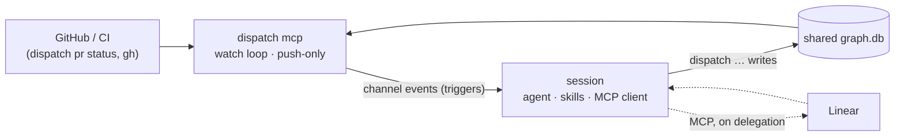

# Design: the CLI as a channel — pushing events into a live session

This design makes the `dispatch` CLI available over MCP as a **Claude Code
channel**, moves the polling loops out of the skills and into the CLI, and lets
the CLI push events — "refresh the graph", "start ticket X", "CI finished on
PR 7" — back into the session that is doing the work.

It supersedes the cold-spawn daemon model in §3.1. Once accepted, §3.1 is
reframed around the channel server described here (see
[Relationship to §3.1](#relationship-to-31)).

## Motivation

Today every wait is a foreground loop the agent runs itself:

- `deliver` **is** a poll loop — `sleep` + `pr-status` re-reads until a PR
  merges, explicitly forbidding `Monitor` and background loops because the
  armed-monitor wake "observably fails on long polls."
- `orchestrate` ticks once per `/loop` firing, re-reading `dispatch graph
  summary` every 1–30 minutes.
- `work-ticket` and `milestone-review` lazily poll tracker threads and
  heartbeat their claims.

The agent burns a turn — and context — sitting in `sleep`. A review that lands
in ten seconds is noticed on the next five-minute tick. The cadence is guesswork
encoded in skill markdown, per skill, with no shared view of what is actually
worth waking for.

The waiting is deterministic infrastructure; the reacting is judgment. This
repo's rule is that determinism belongs in the CLI. Waiting is determinism the
CLI does not yet own.

## Goals

- The CLI holds the waits. The session is woken only when there is something to
  react to.
- Skills stop containing poll loops. `deliver` and `orchestrate` become **event
  handlers**, not loops — while keeping a non-channel fallback (see
  [Channel mode vs fallback mode](#channel-mode-vs-fallback-mode)).
- The CLI decides cadence once, centrally, with the dynamic intervals §3.1
  already specifies — not scattered across skills.
- Preserve the trust boundary: the CLI never gains an MCP client; the session
  keeps it. MCP-only work is delegated back to the session, not pulled into the
  CLI.
- Keep the session's write path unchanged: the session still acts through
  ordinary `dispatch …` commands against the shared SQLite graph, which is also
  how it signals the server.
- Support the concurrency the CLI already allows: multiple sessions working
  different projects at once, without stepping on each other (see
  [Multi-session](#multi-session-many-servers-one-database)).

## Non-goals

- A token/REST tracker adapter. The delegation pattern removes the need for one:
  the session's existing MCP client does tracker work when asked.
- Two-way channel features beyond push — reply tools and permission relay. The
  first cut is push-only; session→server signalling rides the shared DB. These
  stay available as a later option if DB-poll latency proves too slow.

## Background: what a channel is

A [Claude Code channel](https://code.claude.com/docs/en/channels) is an MCP
server that Claude Code spawns as a **stdio subprocess** and that can *push*
events into the running session. The server declares
`capabilities.experimental['claude/channel']: {}` and emits
`notifications/claude/channel` with `{ content, meta }`. The event lands in the
session as a tag:

```text
<channel source="dispatch" kind="ci_finished" repo="o/r" pr="7" rollup="failure">
…pr-status payload…
</channel>
```

`content` is the tag body; each `meta` key becomes an attribute (values are
always strings). Events **queue and coalesce**: several pushed while the agent
is busy arrive together on the next turn, in order. A channel can be push-only
(notifications) or also expose MCP tools; this design uses push-only.

### Constraints to design within

Channels come with several constraints. None is fatal; each shapes a specific
decision.

| Constraint                    | Consequence for this design                                                        |
| ----------------------------- | ---------------------------------------------------------------------------------- |
| Server, not client (no MCP)   | The watch loop can't reach MCP-only sources (Linear); that work is delegated back to the session, which has the MCP client. |
| Session-scoped lifetime       | Each session spawns its own server; the server lives and dies with it. Always-on = a persistent session. |
| Not always available          | Research preview (flags/protocol may change; custom channels need `--dangerously-load-development-channels`), Anthropic-auth only (no Bedrock / Vertex / Foundry), org `channelsEnabled` gate. The skills therefore need a non-channel fallback mode. |
| Injected content              | Event bodies enter the agent's context; the body is the same `dispatch pr status` payload the agent already consumes, so its trust properties are unchanged (see [Injection safety](#injection-safety)). |

The no-MCP boundary is the most interesting of these — it's what makes
delegation a load-bearing pattern rather than a convenience — but it is one
constraint among several, not the whole design.

## The design

### `dispatch mcp`: the server

A new long-running CLI mode, `dispatch mcp`, speaks the channel protocol over
stdio. It is registered like any MCP server (plugin `.mcp.json` /
`--channels plugin:dispatch@…`). Claude Code spawns it as a subprocess when the
session starts; it exits when the session ends. Inside it runs:

- **The watch loop** — the dynamic-cadence poller over the sources the CLI can
  reach directly (§3.1's interval table, now centralized here).
- **The channel emitter** — turns observed changes into `notifications/claude/channel`
  events, coalescing per tick.

It is **push-only**: it exposes no MCP tools. The session steers it the same way
it does everything else — by running `dispatch …` commands that write the
**shared SQLite graph database** the `dispatch graph` commands already use
(`$XDG_STATE_HOME/dispatch/graph.db`, WAL, `busy_timeout`). The server polls
that DB on its tick. So the shared DB is the backbone in both directions: the
server watches it and pushes; the session writes it and is watched. There is no
second control channel to build or keep consistent.



The server reads GitHub/CI and the shared DB and pushes triggers into its
session; the session acts through `dispatch …` writes (which the server then
observes) and reaches the tracker over MCP only when a delegation asks it to.

### Multi-session: many servers, one database

The CLI already lets an operator run several sessions on different projects at
once. That must keep working, and it does so naturally here: **each session
spawns its own `dispatch mcp` server** (channels are per-session subprocesses),
and all servers and sessions share the one graph DB.

Overlap is prevented where it already is — in the DB, not in a coordinator:

- **Atomic claims.** Before emitting a `dispatch_ticket`, a server claims the
  ticket (and a slot) under `BEGIN IMMEDIATE`, so two servers can't hand the same
  ticket to their sessions. Claiming is a pure DB write — no MCP — so the CLI owns
  it end to end.
- **The slot ledger.** `dispatch graph slot acquire` enforces the machine-wide
  compute cap (`maxParallel`) across all sessions, whichever server they belong
  to — the global concurrency limit, in the DB rather than a coordinator process.
- **Liveness-based stale-claim recovery.** Each server registers itself in the DB
  on spawn (session id, pid, `started_at`) and heartbeats a liveness row while
  alive; every claim records the session that owns it. Any server can then tell
  which other sessions are still running and reclaim the claims of ones that are
  not — staleness is "the owning session's server stopped heartbeating," with a
  time threshold as a backstop. One server heartbeat covers all that session's
  claims, and heartbeating moves out of the skills into the server.

So multi-session is a first-class property that falls out of per-session servers
plus the shared DB. Nothing about concurrency is deferred.

### Channel mode vs fallback mode

Channels are not always available (research preview, non-Anthropic auth, org
policy off). The skills therefore keep their current foreground-loop behaviour as
a **fallback mode**, and select between the two the same way they already select
team vs solo behaviour — dynamic loading of a mode variant:

| Mode         | Selected when                              | Waiting behaviour                                             |
| ------------ | ------------------------------------------ | ------------------------------------------------------------ |
| `channel`    | a `dispatch mcp` server is attached        | Skill yields after each unit of work; the CLI wakes it with events. |
| `polling`    | no channel (unavailable / not enabled)     | Current behaviour: the skill runs the foreground `sleep`/`/loop` loop itself. |

Mode is detected from whether a channel server is attached to the session — the
server sets a marker on spawn (env var and/or a `dispatch mcp status` the skill
can query). The judgment content of each skill (what counts as actionable, the
gates, the §2.4 sequence) is identical across modes; only the *waiting* section
differs. This keeps the two modes from diverging into two behaviours.

### Events are triggers

An event is a **trigger**, not a payload to be trusted or acted on in isolation.
Whatever the event says, the session responds by running a `dispatch` command
that reads the canonical state — from the graph DB, or from `dispatch pr status`
— and acts on that. Because [`pr-status` is integrated into the CLI](#dispatch-pr-status-integrating-pr-status),
a PR event can carry *exactly* the `dispatch pr status` payload as its body: the
same bytes the agent would fetch anyway, so there is no separate summary to
craft and no divergence between "what the event said" and "what the CLI returns."
When events coalesce, the agent re-reads for freshness rather than trusting a
possibly-stale body.

Two families:

- **PR/CI triggers** — the CLI saw a change on a PR it is watching. It pushes the
  trigger with the `dispatch pr status` payload as the body; the session applies
  `deliver`'s judgment. Judgment is genuinely the session's here — deciding what a
  review or a failing check demands is not deterministic.
- **Work orders** — the CLI did the deterministic graph reasoning itself (rank the
  frontier, apply the milestone gates, account for slots, claim) and tells the
  session exactly what to do next: coordinate this ticket, review this milestone,
  refresh the graph. The session runs the named skill and **never has to
  understand the graph**. A tracker refresh is a work order too: the CLI can't
  read an MCP-only tracker, so it asks the session — which holds the MCP client —
  to do it and write the delta back through `dispatch graph …`.

### Event catalog

Every event carries `source` (set automatically to the server name), a `kind`,
and a monotonic `seq` for ordering/coalescing. Meta values are strings; each meta
key consists only of letters, digits, and underscores (anchored `^[a-z0-9_]+$`) —
the channel layer silently drops any key with a hyphen, so it is `pr`, never
`pr-number`. Bodies are either the canonical `dispatch pr status` payload or a
short instruction; never raw external text assembled by the server.

**PR / CI triggers** — body is the `dispatch pr status` payload for `repo`/`pr`.

| kind              | meta (beyond source/kind/seq)                     | fires when                                        |
| ----------------- | ------------------------------------------------- | ------------------------------------------------- |
| `ci_finished`     | `repo`, `pr`, `rollup` = success\|failure\|error  | the check rollup reaches a terminal state         |
| `pr_review`       | `repo`, `pr`, `state` = approved\|changes\|comment, `reviewer` | a review is submitted                 |
| `pr_comment`      | `repo`, `pr`, `thread`                            | a new top-level comment or inline reply lands     |
| `pr_state_change` | `repo`, `pr`, `state` = ready\|draft\|merged\|closed | the PR changes lifecycle state                 |

**Work orders** — body is a short instruction naming the skill to run. The CLI
has already done the scheduling (ranked, gated, slotted, and — for
`dispatch_ticket` — claimed) before it emits one, so the session just executes.

| kind                       | meta (beyond source/kind/seq) | asks the session to                                              |
| -------------------------- | ----------------------------- | --------------------------------------------------------------- |
| `dispatch_ticket`          | `project`, `ticket`           | run `work-ticket` for the ticket (already claimed for this session, with a slot held) |
| `perform_milestone_review` | `project`, `milestone`        | run `milestone-review` — the milestone's gate is open           |
| `refresh_graph`            | `tracker`, `reason`           | run `build-graph` against the tracker and write the delta (the CLI can't read the tracker itself) |

New kinds may be added; renaming a kind is a breaking change.

### What the CLI watches directly

| Source              | Mechanism (no MCP)                                   | Emits                                            |
| ------------------- | ---------------------------------------------------- | ------------------------------------------------ |
| GitHub PR / CI      | `dispatch pr status` internals (the integrated `pr-status` logic + `gh pr checks --watch` / `bk build wait`) | `ci_finished`, `pr_review`, `pr_comment`, `pr_state_change` |
| Graph DB (own state)| SQLite reads on a tick; the CLI ranks, gates, slots, and claims | `dispatch_ticket`, `perform_milestone_review`    |
| Tracker (Linear …)  | **cannot** — asked of the session as a work order     | `refresh_graph`                                  |

Scheduling runs through the same derivation layer (`derive.mts` / `queries.mts`)
the `graph` commands use, entirely inside the CLI. The session receives only the
resulting work orders and never re-derives the frontier.

### `dispatch pr status`: integrating pr-status

`pr-status` today is a standalone ~710-line bash script that does far more than
`gh pr view`: it drives `gh api graphql` + REST, classifies actionability,
applies the §2.2 wire format, and maintains a disk cache. This design **moves it
into the CLI as a `dispatch pr status` subcommand** — a port from bash to the
`.mts` CLI, and a deliberate rename of the current `dispatch pr-status`
interaction command (§2.2, §3.2.3). The spec keeps the hyphenated `dispatch
pr-status` spelling until this rename lands; this design doc uses the proposed
`dispatch pr status` throughout. One payload implementation then serves two
surfaces:

- **CLI output** — the session runs `dispatch pr status --pr 7` and gets the §2.2
  document, exactly as `deliver` reads it today.
- **Channel event body** — the watch loop emits the *same* payload as the body of
  `ci_finished` / `pr_review` / `pr_comment` / `pr_state_change`.

Because the watch loop already computes this payload to decide whether anything
changed, emitting it costs nothing extra, and the agent never sees a PR
representation that disagrees with the CLI. Porting `pr-status` is a prerequisite
for the PR/CI phase, not an afterthought.

### How the two loops become event handlers

**`orchestrate`** (in `channel` mode). The `/loop`-driven tick loop goes away, and
with it the session's need to read `graph summary` and decide what to run — the
CLI does the scheduling now. The session opens, then yields. Each work order is
one unit of work: on `dispatch_ticket`, run `work-ticket` for the named ticket;
on `perform_milestone_review`, run `milestone-review`; on `refresh_graph`, refresh
from the tracker and write the delta. The ranking, gating, slot accounting, and
claiming that lived in `orchestrate` move into the CLI, along with the dynamic
cadence table from `orchestrate/reference.md`.

**`deliver`** (in `channel` mode). The `sleep`+`pr-status` loop goes away. When
the session opens a PR it records it (a `dispatch` write the server observes),
then yields. The CLI watches CI and reviewers and pushes `ci_finished` /
`pr_review` / `pr_state_change`. Each event wakes the session to run deliver's
existing per-tick judgment **once** — address actionable concerns, evaluate
gates — then yield again. On merge/close it clears the watch. Deliver's judgment
(§2.4) is unchanged; only the waiting is relocated.

In `polling` mode both skills behave exactly as they do today.

### Injection safety

Channel content enters the agent's context and is influenced by whoever can
comment on a PR or ticket. The key point: the event body is the **same `dispatch
pr status` payload the agent already consumes** as its sole PR read path, so
pushing it introduces no exposure the agent didn't already have when it pulled
it. The server never assembles a bespoke body out of raw external strings; graph
and delegation events carry only identifiers and a short instruction. Meta keys
are `snake_case` per the channel layer's rules. If two-way features (reply tool,
permission relay) are added later, the channel reference's sender-gating and
untrusted-field rules apply.

## Deployment and lifecycle

- **Always-on = a persistent session.** Channels deliver only while a session is
  open. A participating session runs in a long-lived context (persistent
  terminal, `tmux`, or a background `claude` process). When it exits, its
  `dispatch mcp` server exits with it and its waiting stops until it restarts;
  other sessions' servers are unaffected.
- **Restart is cheap; the server holds no durable state.** All durable state is
  in the shared graph DB and on the platforms. On restart a server rehydrates
  its watch set from the DB (this session's open claims and un-merged PRs) — no
  conversation history, no event spool of its own.
- **Preview flags.** Channels are a research preview. Until the `dispatch` plugin
  is on the channel allowlist — the Anthropic-maintained `claude-plugins-official`
  set, or an organization's `allowedChannelPlugins` managed setting — sessions
  load it with `--dangerously-load-development-channels`, and org `channelsEnabled`
  must be on. Document both in the plugin README. If the channel capability is
  refused at startup, the server says so and the skills fall back to `polling`
  mode rather than failing.

## Relationship to §3.1

§3.1 solved the same problem — keep work alive across CI/review/ticket gaps —
with a **separate machine-wide daemon that cold-spawns a fresh runner per
event** (`--resume <session-id>`, prompt templates, PID lock, `events/` spool,
crash recovery). This design keeps §3.1's *analysis* and discards its *delivery
mechanism*:

**Kept:** the event taxonomy, coalescing, the dynamic polling-interval table, and
the per-source strategy ladder (SDK watch → watch subprocess → polling) — now
running inside each session's `dispatch mcp` server.

**Dropped:** cold-spawn-per-event, prompt-template resolution, the runner spawn
contract, the on-disk event spool, and — crucially — the **single-daemon-per-
machine** model. A warm session replaces the runner (no prompt templates or
session-id resume; the session already has its skills). Machine-wide concurrency
and crash recovery, which the daemon centralised, are handled by the shared DB's
slot ledger and stale-claim recovery across independently-launched per-session
servers. Nothing here is deferred to a future daemon.

The spec change (tracked on this branch): §3.1 is reframed from "Daemon" to the
per-session channel server, and a new normative subsection specifies the
**channel message protocol** — the event catalog above, the meta-field
vocabulary, coalescing, and the shared-DB signalling contract.

## Phased plan

1. **Channel skeleton.** `dispatch mcp` speaks the channel protocol; declares the
   capability; sets the mode marker; pushes a hand-triggered test event. Prove
   delivery into a session end-to-end behind the dev flag.
2. **Mode selection.** Add `channel`/`polling` dynamic loading to `orchestrate`
   and `deliver`, with `polling` = today's behaviour and `channel` a stub that
   yields. No behaviour change when no channel is attached.
3. **Graph scheduling + orchestrate.** Move ranking, gating, slot accounting, and
   claiming into the CLI; add the session/server liveness registry for stale-claim
   recovery. Emit `dispatch_ticket` / `perform_milestone_review` work orders and
   wire `orchestrate`'s `channel` mode to execute them.
4. **Tracker refresh.** Emit `refresh_graph` on the tracker cadence; `build-graph`
   becomes its handler. Retire `orchestrate`'s self-timed tracker reads in
   `channel` mode.
5. **Port `pr-status` → `dispatch pr status`.** Move the bash logic into the CLI;
   keep byte-for-byte output parity so `deliver`'s reads are unaffected.
6. **PR/CI events + deliver.** Watch CI and reviewers; emit the PR triggers with
   the `dispatch pr status` payload as the body; wire `deliver`'s `channel` mode.
   The heaviest poller retires.
7. **Cadence + hardening.** Port the dynamic-interval table; coalescing;
   restart-rehydration from the graph DB; multi-session soak (two sessions, one
   DB, no overlap).

## Open questions

- **Work-order idempotency.** A work order pushed after the session has exited is
  dropped silently (channel notifications aren't acknowledged). For
  `dispatch_ticket` the claim + liveness registry recovers it — the claim is
  reclaimed and re-emitted. For `refresh_graph`, which owns no claim, the server
  must re-derive "a refresh is owed" from DB state on restart; what's the DB
  representation — a due-time on the tracker cursor, a pending-work row?
- **CI provider abstraction.** `ci_finished` spans `gh pr checks --watch` and
  `bk build wait`, which are different subprocesses with different terminal
  signals; the watch loop needs a provider seam.
- **Signalling latency.** Push-only + DB-poll means a session's "start watching
  this PR" is seen on the server's next tick, not instantly. If that lag ever
  matters, a minimal two-way tool surface is the fallback — kept out of the first
  cut deliberately.
