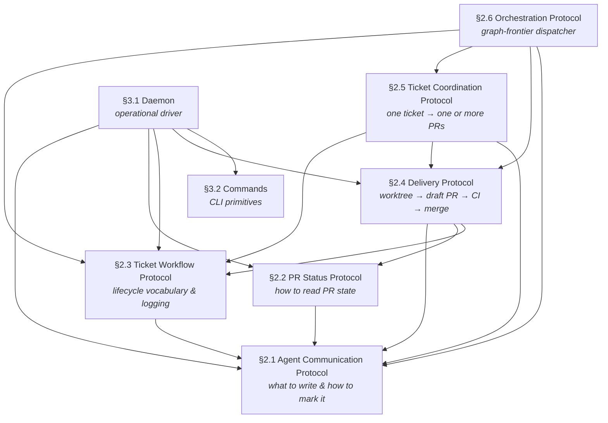

# §1 — Introduction

## What this spec covers

This specification defines the protocols and operational contracts that govern
how Dispatch agents communicate, track work, advance pull requests from first
commit to merge, and orchestrate whole projects across a dependency graph. It
covers six conformance protocols and one operational layer:

- **§2.1 Agent Communication Protocol** — the on-the-wire format for every
  comment an agent writes into a PR, issue, or ticket thread.
- **§2.2 PR Status Protocol** — the data format and caching contract for
  answering "what is the state of this PR?" deterministically.
- **§2.3 Ticket Workflow Protocol** — the abstract lifecycle vocabulary shared
  across all supported ticket trackers, and the operational norms (logging,
  communication restriction, decomposition) agents must follow.
- **§2.4 Delivery Protocol** — the rules any agent must follow when changing
  code: worktree isolation, the PR-open sequence, pre-push review, CI and
  reviewer gating, and termination.
- **§2.5 Ticket Coordination Protocol** — how one agent drives a single ticket
  to a terminal role by producing and landing one or more PRs (§2.4), applying
  the §2.3 transitions, decomposing, and handing off to a human when needed.
- **§2.6 Orchestration Protocol** — how a thin, graph-driven dispatcher works a
  whole project (or several) by fanning out §2.5 coordinators over a merged
  dependency graph: the project-graph document, the producer/cursor contract,
  the stateless tick, slot accounting, the milestone-review gate, and injection.
- **§3.1 Daemon** — the daemon process model, spawn contract for agent
  sessions, event taxonomy, and prompt template system.
- **§3.2 Commands** — the full `dispatch` CLI command reference, including the
  interaction commands the protocols depend on (e.g., `create-comment`,
  `request-review`).

## What this spec does not cover

- Skill choreography — which steps to run in which order within a session.
- The specific API calls, SDK methods, or shell commands that implement each
  protocol requirement.
- Non-GitHub PR platforms (GitLab, Gitea, Bitbucket) and non-Linear ticket
  trackers beyond the mappings explicitly defined in §2.3.
- Agent runner internals — the spec treats the runner as a black box invoked
  by the daemon.

## How to read this spec

Sections contain some combination of **narrative** material (context, rationale,
annotated examples, and design intent) and **normative** material (formal
requirements, wire formats, state machines, and tables).

Read narrative material to understand *why* requirements exist. Read normative
material to understand *what* must be implemented. When they conflict, normative
requirements govern.

## Conformance language

This spec uses [RFC 2119](https://www.rfc-editor.org/rfc/rfc2119) conformance
terms throughout. **MUST** and **MUST NOT** denote absolute requirements.
**SHOULD** and **SHOULD NOT** denote strong recommendations with valid reasons
to deviate. **MAY** denotes optional behavior.

## Key concepts

### Roles

Three role terms recur throughout the spec. Use them precisely; the spec
avoids the bare phrase "the human" (singular, definite) as a load-bearing
term because it conflates the directing user with whoever happens to be
reviewing.

- **Agent** — an agentic coding assistant doing work on behalf of an
  operator. An agent may share platform credentials with its operator
  (Mode B) or run under its own bot-typed account (Mode A).
- **Operator** — the individual directing an agent. Almost certainly a
  human. There is exactly one operator per agent session. The operator is
  the only human with stop authority over the agent.
- **Reviewer** — any participant — Copilot, another agent, or a human —
  leaving review feedback on a PR. The operator may also be a reviewer of
  the agent's PRs.

"Human" remains in the spec as a category contrasted with bots/agents —
"human reviewer", "human-credentialed account", "human reply" — but the
load-bearing role terms are agent, operator, and reviewer.

### Agent identity and modes

An agent session runs under credentials that identify either a dedicated
bot/service account or a human user's account. The installation declares
which kind the agent holds via the `credential_mode` configuration value, and
that declaration determines the **mode** for all writes the agent makes:

- **Mode A** (`credential_mode: dedicated`) — the agent has its own dedicated
  bot or service account. The byline already tells readers the author is not
  human; no additional visual marker is needed.
- **Mode B** (`credential_mode: shared`) — the agent uses the operator's own
  account. The byline is indistinguishable from a human comment; a visible
  sparkle wrapper is required so humans can tell the agent's words from their
  own.

A writer's own mode is configuration, never inferred from its account. When
nothing is configured, default to Mode B. §2.1 also defines the read-side
predicate for classifying *other* participants' accounts (e.g. review
authors), which necessarily remains inference-based.

### Comment venues

Agents write into three venues:

1. **PR issue comments** — the top-level thread on a pull request.
2. **PR inline review comments** — threads anchored to a file and line.
3. **Ticket comments** — comments on an issue in any supported tracker.

The in-product chat inside the Claude Code client is a distinct surface and is
not a substitute for writing into these venues. §2.1 governs what agents write
into all three.

### Abstract ticket lifecycle

Supported ticket trackers (Linear, GitHub Issues, Asana) disagree on state
names and cardinality. The spec maps every tracker's native states onto a
shared vocabulary of **roles** and **groups** so protocol rules can be written
once and applied to any tracker. §2.3 defines the full vocabulary and the
per-tracker default mappings.

### The daemon

Agent sessions are transient. Engineering work spans hours and days — CI runs,
human reviewers, tracker state transitions. The `dispatch` daemon is a
long-running process that keeps tasks alive across those gaps: it subscribes to
event sources, resumes the appropriate agent session when an event arrives, and
holds tasks in persistent state on disk between events. §3 defines the daemon
in full.

## Architecture overview

The diagram below shows how the six protocols relate and where the daemon
sits. Arrows indicate "depends on" / "references."

**Reading order for implementors:** §2.1 → §2.2 → §2.3 → §2.4 → §2.5 → §2.6 →
§3. Each section is written to be readable in isolation once §2.1 is understood.
