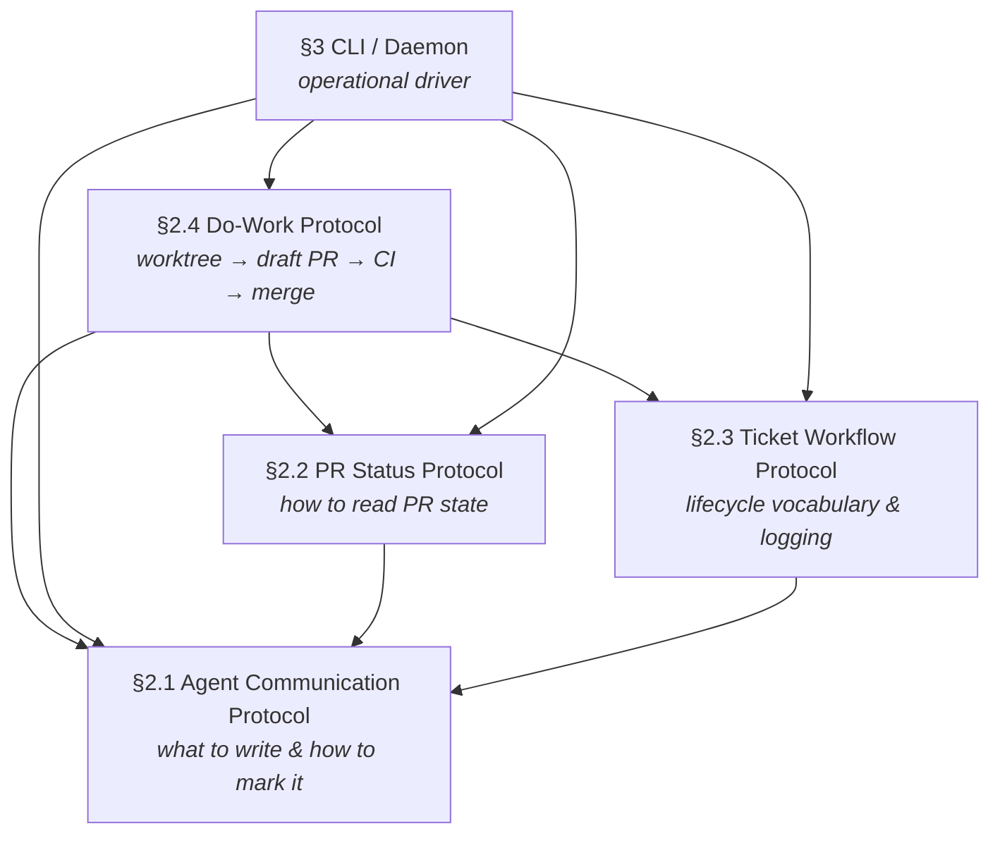

# §1 — Introduction

## What this spec covers

This specification defines the protocols and operational contracts that govern
how Dispatch agents communicate, track work, and advance pull requests from
first commit to merge. It covers four conformance protocols and one operational
layer:

- **§2.1 Agent Communication Protocol** — the on-the-wire format for every
  comment an agent writes into a PR, issue, or ticket thread.
- **§2.2 PR Status Protocol** — the data format and caching contract for
  answering "what is the state of this PR?" deterministically.
- **§2.3 Ticket Workflow Protocol** — the abstract lifecycle vocabulary shared
  across all supported ticket trackers, and the operational norms (logging,
  communication restriction, decomposition) agents must follow.
- **§2.4 Do-Work Protocol** — the rules any agent must follow when changing
  code: worktree isolation, the PR-open sequence, pre-push review, CI and
  reviewer gating, and termination.
- **§3 CLI and Daemon** — the `dispatch` binary: every command, the daemon
  process model, the spawn contract for agent sessions, and the event taxonomy.

## What this spec does not cover

- Skill choreography — which steps to run in which order within a session.
- The specific API calls, SDK methods, or shell commands that implement each
  protocol requirement.
- Non-GitHub PR platforms (GitLab, Gitea, Bitbucket) and non-Linear ticket
  trackers beyond the mappings explicitly defined in §2.3.
- Agent runner internals — the spec treats the runner as a black box invoked
  by the daemon.

## How to read this spec

Each section has two files:

- **Narrative** (`01-narrative.md`) — context, rationale, annotated examples,
  and design intent. Read this to understand *why* requirements exist.
- **Normative** (`02-normative.md`) — formal requirements, wire formats, state
  machines, and tables. Read this to understand *what* must be implemented.

The normative file is authoritative. When a narrative explanation and a
normative rule appear to conflict, the normative rule governs.

## Conformance language

This spec uses [RFC 2119](https://www.rfc-editor.org/rfc/rfc2119) conformance
terms throughout. **MUST** and **MUST NOT** denote absolute requirements.
**SHOULD** and **SHOULD NOT** denote strong recommendations with valid reasons
to deviate. **MAY** denotes optional behavior.

## Key concepts

### Agent identity and modes

An agent session runs under credentials that identify either a dedicated
bot/service account or a human user's account. This single fact — "who does
the platform think is writing?" — determines the **mode** for all writes the
agent makes in that session:

- **Mode A** — the account is recognized as a bot or service. The byline
  already tells readers the author is not human; no additional visual marker
  is needed.
- **Mode B** — the account belongs to a human. The byline is
  indistinguishable from a human comment; a visible sparkle wrapper is
  required so humans can tell the agent's words from their own.

Mode is determined at write time from credentials, not from configuration. On
uncertainty, default to Mode B. §2.1 defines the full detection predicate.

### Comment venues

Agents write into three venues:

1. **PR issue comments** — the top-level thread on a pull request.
2. **PR inline review comments** — threads anchored to a file and line.
3. **Ticket comments** — comments on an issue in any supported tracker.

The in-product chat inside the Claude Code client is a distinct surface and is
not a substitute for writing into these venues. §2.1 governs what agents write
into all three.

### Abstract ticket lifecycle

Supported ticket trackers (Linear, GitHub Issues, Asana) disagree on state
names and cardinality. The spec maps every tracker's native states onto a
shared vocabulary of **roles** and **groups** so protocol rules can be written
once and applied to any tracker. §2.3 defines the full vocabulary and the
per-tracker default mappings.

### The daemon

Agent sessions are transient. Engineering work spans hours and days — CI runs,
human reviewers, tracker state transitions. The `dispatch` daemon is a
long-running process that keeps tasks alive across those gaps: it subscribes to
event sources, resumes the appropriate agent session when an event arrives, and
holds tasks in persistent state on disk between events. §3 defines the daemon
in full.

## Architecture overview

The diagram below shows how the four protocols relate and where the daemon
sits. Arrows indicate "depends on" / "references."

**Reading order for implementors:** §2.1 → §2.2 → §2.3 → §2.4 → §3. Each
section is written to be readable in isolation once §2.1 is understood.
