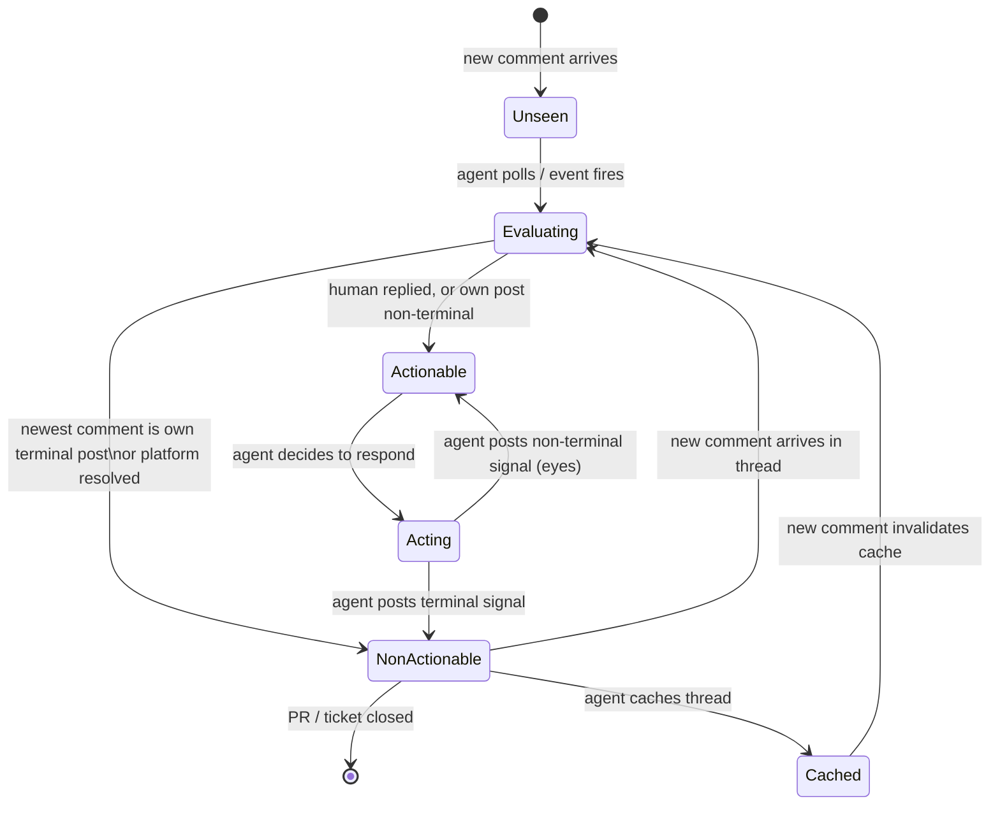

# §2.1.1 — Agent Communication Protocol: Narrative

## The attribution problem

When a human runs Claude Code on their laptop or inside a hosted client, the
agent posts comments using that human's credentials. On GitHub this means the
comment's byline reads as the human's username — indistinguishable from
something the human typed. The same is true on Linear, Jira, Asana, and every
other tracker that doesn't expose separate bot identities.

This creates two distinct problems:

1. **Human readers can't tell who wrote what.** A reviewer scanning a PR
   comment thread needs to know whether a concern was raised by their
   colleague or generated by an agent — those carry different weight and
   warrant different responses.

2. **Agents re-evaluate their own work.** When an agent polls a comment stream
   looking for new instructions, it will encounter its own prior posts. Without
   a way to recognize them, it re-evaluates everything every time — leading to
   feedback loops and duplicate replies.

The protocol solves both problems with two markers: a **machine-readable marker**
embedded in every agent post (addresses problem 2) and a **visible sparkle
wrapper** around posts made under human credentials (addresses problem 1).

## Two modes, one simple rule

Whether an agent needs the sparkle wrapper depends entirely on the credentials
it is using — not on configuration, not on the environment type, not on how the
agent was launched.

**Mode A** applies when the platform can tell on its own that the author is not
human. A GitHub App, a bot-typed account, or any account whose identifier
matches a well-known agent pattern (`*copilot*`, `*claude*`, `*codex*`,
`*ai-agent*`) already signals "this is automated" through the byline. Wrapping
the post in sparkles would be redundant. The machine marker is still required
so other agents can parse it programmatically.

**Mode B** applies when the account is a real human's account. Nothing in the
byline tips off readers. The sparkle wrapper makes the distinction unmistakable
at a glance:

```
<!-- agent-reply:dispatch -->
✨

The implementation in `auth.ts` looks correct. I've added a test
for the token-expiry edge case in the follow-up commit.

✨
```

The rule on uncertainty is: **default to Mode B**. A spurious sparkle wrapper
on a bot account is mildly redundant; a missing wrapper on a human-credentialed
account is a protocol violation that misleads readers.

## The three comment venues

Agents write into three places, each with its own threading model:

**PR top-level comments** are a flat chronological stream. Any participant can
post; there is no thread nesting beyond the stream itself.

**PR inline review comments** are anchored to a specific file and line number
and can be replied to, forming nested threads. A thread starts when someone
opens a review comment on a line; replies accumulate under it. GitHub's
"Resolve" button closes a thread from further consideration.

**Ticket comments** live on issues in whatever tracker is in use. Some trackers
(GitHub Issues, Linear) support threaded replies within a comment; others offer
only a flat stream. The protocol treats each thread — whether a GitHub review
thread or a Linear comment thread — identically.

The in-product Claude Code chat is not one of these venues. The protocol governs
what agents write into the three external venues above. The chat may mirror
agent activity but is not a substitute for it, because other humans and other
agents cannot reliably observe the chat stream.

## How agents avoid re-evaluating their own work

On each poll or event, an agent sees the full comment stream including its own
prior posts. The naive approach — skip any comment from "myself" — is wrong,
because a human may have replied to an agent post and the thread is now
actionable again.

The protocol's answer is **terminal signals**: when an agent has decided it is
done with a comment or thread, it leaves a signal that marks it as processed.
On GitHub this is a reaction (+1, -1, or rocket); on platforms without reactions
it is a closing text token at the end of the reply body (`Done.`, `Declined.`,
`Shipped.`).

A terminal signal on the agent's most-recent comment in a thread means "I have
finished with this; don't re-examine it." A human reply after that signal
removes the "finished" status — the thread becomes live again and the agent
re-evaluates it.

The key insight: the agent is not ignoring its prior posts. It is tracking *what
has been decided* so it only acts on things that need a new decision.

## The review challenge in Mode B

On GitHub, you cannot approve or request changes on a pull request you authored.
This restriction applies to the account, not the person — so in Mode B, where
the agent and the human share an account, the constraint applies in both
directions:

- The agent **cannot approve or request changes** on PRs authored by the human,
  because it shares the author's account. It can only leave Comment-style
  reviews.
- The human **cannot formally approve or request changes** on PRs the agent
  authored using the same account. Any feedback the human leaves will be
  Comment-style review comments.

The practical consequence: agents in Mode B must not wait for a formal
"Request changes" review state on their own PRs — it will never arrive. Every
comment the human leaves, review or otherwise, must be treated as substantive
feedback. The do-work protocol (§2.4) handles this in detail.

In Mode A (dedicated bot account), the human and the agent have separate
identities and neither restriction applies.

## Thread lifecycle

The diagram below illustrates the lifecycle of a single comment thread from the
agent's perspective. The formal rules behind each transition are defined in
§2.1.2 (read-side rules and terminal signals).


