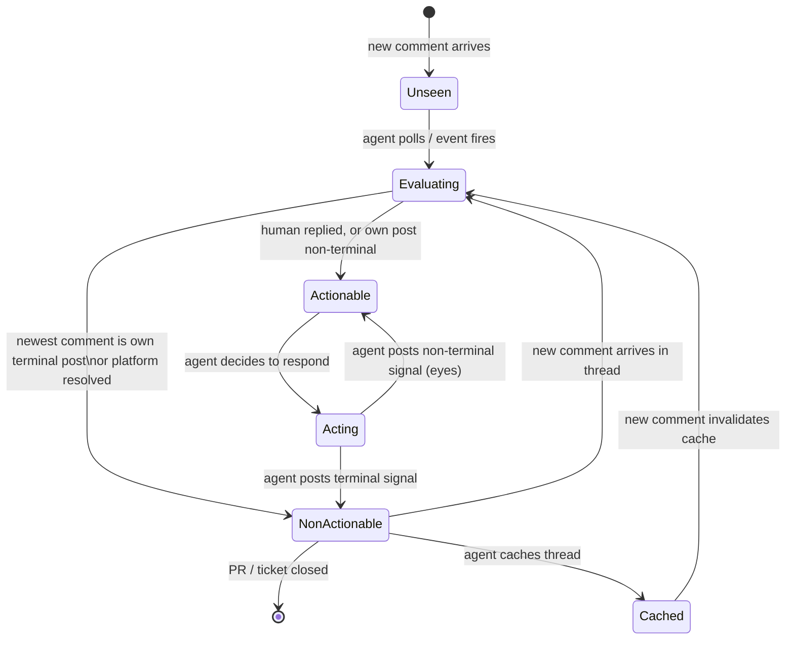

# §2.1.2 — Agent Communication Protocol: Normative

## Runtime environments

The mode an agent operates in is determined solely by the credentials it holds
at write time. Environment type, launch mechanism, and configuration do not
affect mode.

| # | Environment                 | Typical auth                  | Mode                   |
| - | --------------------------- | ----------------------------- | ---------------------- |
| 1 | Claude Code CLI on laptop   | User's platform credentials   | B (human-credentialed) |
| 2 | Claude Code on the web      | User's platform credentials   | B (human-credentialed) |
| 3 | Claude Code in a sandbox    | Dedicated `ai-agent` identity | A (agent-credentialed) |
| 4 | Claude Code iOS / macOS app | User's platform credentials   | B (human-credentialed) |

### Hosted Claude Code clients

The hosted Claude Code clients (web, desktop, iOS / macOS app) use their own
protocol for GitHub interactions. That protocol is acceptable as-is and this
specification does not override it for GitHub PRs and issues. For every other
venue this specification covers — most notably ticket comments on non-GitHub
trackers — hosted clients MUST follow this specification the same way the CLI
does.

## Mode detection

Every writer MUST implement a predicate "is this human-credentialed?" and apply
it at write time. The predicate returns **Mode B** (human-credentialed) or
**Mode A** (agent-credentialed).

### Mode A signals

An account is Mode A if **either** of the following holds:

1. **Platform-typed identity.** The platform explicitly classifies the account
   as a bot, integration, or service account (e.g. GitHub's `type: "Bot"`
   field on a user object). Any such classification is Mode A regardless of the
   account name.

2. **Name matching.** The account identifier (login, display name, or email
   local-part — whichever the platform surfaces) matches at least one of the
   following glob patterns, evaluated case-insensitively:

   ```
   *copilot*
   *codex*
   *claude*
   *ai-agent*
   ```

   Name matching applies on every platform, including those that do not support
   typed identities.

### Default

**If the identity lookup fails or the result is ambiguous, the writer MUST
default to Mode B.** Adding a sparkle wrapper to a bot account is harmless;
omitting it from a human account is a protocol violation.

## Wire format

### Machine marker

Every agent-authored post MUST contain exactly one machine marker. The marker
identifies the post as agent-authored and carries the agent's identity so
multiple agents can coexist on the same thread.

**Syntax (ABNF):**

```abnf
machine-marker = "<!-- agent-reply" [":" agent-id] " -->"
agent-id       = 1*( ALPHA / DIGIT / "-" / "_" / "." )
ALPHA          = %x41-5A / %x61-7A   ; A-Z / a-z
DIGIT          = %x30-39             ; 0-9
```

The marker MUST appear as the **first line** of the post body, alone on its own
line, with no leading whitespace.

**Platform considerations.** Where the platform preserves HTML comments
verbatim (GitHub Markdown, most Markdown renderers), the ABNF form above is
used. Where the platform strips HTML comments or only accepts structured content
(Atlassian Document Format, rich-text editors), the writer MUST carry the same
information using the mechanism the platform reliably preserves — a custom
field, a trailing sentinel line, or a hidden structured-content node. The
specific form is platform-dependent; the requirement is that readers on the same
platform can reliably detect and parse it.

A bare `<!-- agent-reply -->` (omitting `:<agent-id>`) is accepted for
backwards compatibility and means "some agent wrote this, identity unknown."

### Mode B sparkle wrapper

In Mode B, the post body MUST be wrapped in a sparkle block **after** the
machine marker:

```
{machine-marker}
✨

{body}

✨
```

**Rules:**

- The sparkle character is U+2728 (✨) on its own line.
- One blank line separates the opening sparkle from the body.
- One blank line separates the body from the closing sparkle.
- The body is opaque to this protocol. It MAY contain ✨ characters; the
  wrapper is identified by the leading and trailing lines, not by scanning
  the body.
- The sparkle wrapper MUST NOT appear in Mode A posts.

**Complete Mode B example:**

```
<!-- agent-reply:dispatch -->
✨

The implementation looks correct. I've added a test for the
token-expiry edge case in the follow-up commit.

✨
```

**Complete Mode A example:**

```
<!-- agent-reply:dispatch -->
The implementation looks correct. I've added a test for the
token-expiry edge case in the follow-up commit.
```

## Read-side rules

### Thread-aware filtering

Every comment in every thread remains relevant context — there is no blanket
rule to skip agent-authored posts. What changes between polls is whether a
thread is **actionable**: whether the agent needs to take a new action.

A thread is **non-actionable** when **any** of the following holds:

- The newest comment in the thread was written by this agent AND carries a
  terminal signal (see §Terminal signals below).
- The platform has explicitly resolved the thread (e.g. GitHub's "Resolved"
  state on a review thread).

A thread is **actionable** otherwise. The most important actionable case is a
human reply after the agent's last turn: the whole thread is back in play.

Non-actionable threads still inform the agent's understanding of the broader
conversation and MUST remain available as context. They do not require a new
reply or reaction.

### Caching

Non-actionable threads MAY be kept in a local cache (scoped to the PR or
ticket) and loaded on demand rather than re-fetched every poll. The cache MUST
preserve thread content verbatim. Cache invalidation is the implementor's
responsibility; the most critical case is a thread becoming actionable again due
to a new comment.

## Terminal signals

A terminal signal communicates "the agent has finished with this item." A
non-terminal signal communicates "the agent has seen this and is still working."

### Reactions (GitHub and platforms with reaction support)

| Reaction | Semantics                                       |
| -------- | ----------------------------------------------- |
| `+1`     | Terminal. Addressed / agreed.                   |
| `-1`     | Terminal. Rejected (with an explaining reply).  |
| `rocket` | Terminal. Shipped / merged / applied.           |
| `eyes`   | Non-terminal. Seen; work in progress.           |

Any other reaction (`heart`, `hooray`, `laugh`, `confused`, …) is permitted but
carries no protocol meaning. Only the terminal reactions above suppress
re-evaluation on the next poll.

### Text tokens (platforms without reactions)

On platforms without a reactions mechanism, the equivalent terminal signal is a
token on its own line at the end of the reply body:

| Token       | Semantics                                                       |
| ----------- | --------------------------------------------------------------- |
| `Done.`     | Terminal. Addressed / agreed (equivalent to `+1`).             |
| `Declined.` | Terminal. Rejected — explanation immediately above (≡ `-1`).   |
| `Shipped.`  | Terminal. Shipped / merged / applied (equivalent to `rocket`). |

The token MUST be the **last non-empty line** of the body so readers can detect
it with a suffix match. There is no non-terminal text token; the absence of any
terminal token means "still working."

On a platform that has neither reactions nor reliably preserved markers, the
agent SHOULD fall back to a private state store keyed by comment id rather than
degrading the in-stream protocol.

## Writing rules

Three write operations exist:

| Operation          | Carries body | Machine marker required | Sparkle required (Mode B) |
| ------------------ | ------------ | ----------------------- | ------------------------- |
| New top-level post | Yes          | Yes                     | Yes                       |
| Reply in thread    | Yes          | Yes                     | Yes                       |
| Reaction           | No           | No                      | No                        |

Reactions carry no body and therefore require neither marker.

## Review rules

### Requesting a review

Some platforms restrict certain review types to human accounts. GitHub only
allows human users to request a Copilot review, not bot accounts. When an agent
in Mode A needs to request such a review, it MAY obtain alternative credentials
(a token belonging to a human user, granted for the purpose). The specifics are
a platform- and deployment-level concern.

An agent MUST NOT request a review from the same account it is authenticated
as. Most platforms reject self-review requests; even where they do not, the
result is meaningless.

### Leaving a review (Mode B)

In Mode B the agent shares a user account with a human. Most platforms forbid
that user from submitting an Approve or Request-changes review on their own PR.
The agent therefore MUST NOT submit Approve or Request-changes reviews on PRs
authored under its current credentials. It MUST submit Comment-style reviews
instead.

Each comment the agent writes inside such a review is a question or request for
action directed at the human. The agent MUST apply the same read-side and
terminal-signal rules to any subsequent replies.

### Reading a review (Mode B, inverse)

When a human reviews a PR authored by the agent under the same account, the
human also cannot submit Approve or Request-changes reviews. The agent therefore
MUST NOT wait for a formal Request-changes review state on its own PRs. Every
comment the human leaves — review comment, inline comment, or top-level PR
comment — MUST be evaluated as either a question to answer or an implicit
change request to act on. Treating the absence of a Request-changes state as
"no changes requested" is a conformance violation.

## State diagram

The following diagram shows the lifecycle of a single comment thread from the
agent's perspective.


