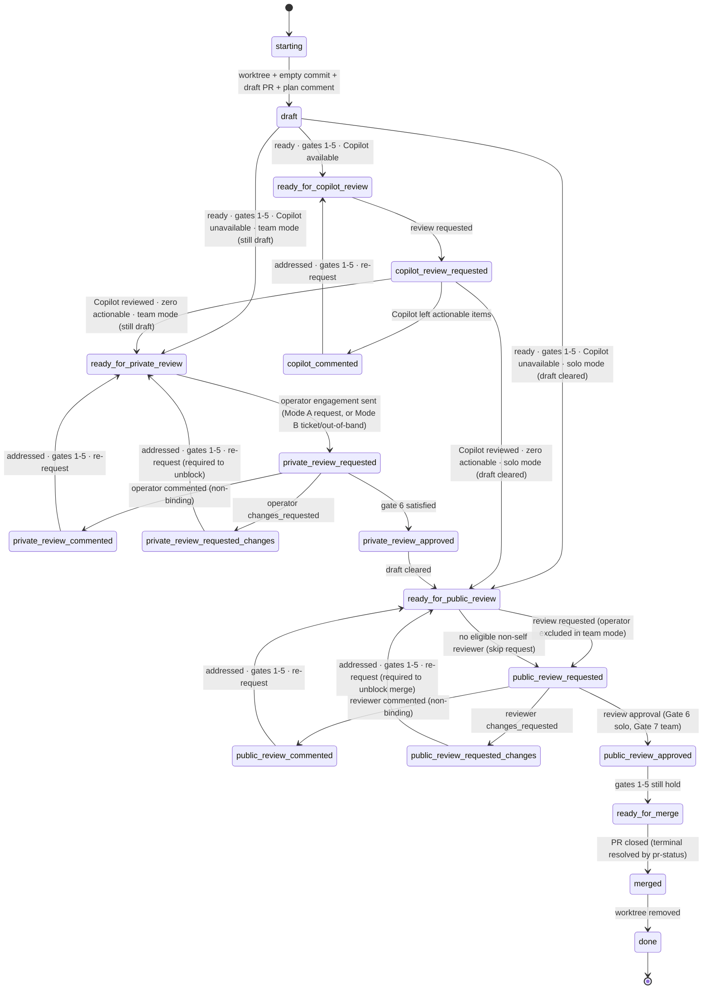

# deliver

Land a code change via a PR. Each tick: run `scripts/pr-status`, address every
actionable concern, then evaluate the gates to decide whether to transition.

**Operator** = the one human directing this agent; the only human with stop
authority. Role glossary in [`reference.md`](./reference.md#roles-1).

**Running `pr-status`.** It requires env `DISPATCH_AGENT_ID`, `DISPATCH_SKILL`,
`DISPATCH_OPERATOR_LOGIN` and hard-fails if any is unset. The operator is
`CLAUDE_PLUGIN_OPTION_OPERATOR_LOGIN`; if it's unset, fail and ask the user to
set an operator login — never fall back to the ticket assigner.

## Setup

1. **Worktree.** Work in `<worktree_base>/<owner>/<repo>/<branch>` (the plugin
   sets `worktree_base`; fail if it's unset). Locate via `git worktree list` —
   never guess. Reuse if present.
2. **Open PR** (skip if one already exists for the branch):
   - `git commit --allow-empty -m "chore: open PR [skip ci]"` — never amend or
     squash this commit.
   - Push; open a **draft** PR. Body: Motivation, Ticket link (omit if none —
     no bare IDs), Test plan. **No execution plan in the body.**
   - Post the plan as a top-level comment with `<!-- agent-plan:<agent-id> -->`
     inside the wire-format body (after the marker/sparkle, not as the first
     line; see [`reference.md`](./reference.md#wire-format)). Pin if supported.
3. **Resume.** PR exists → reuse worktree, skip the open sequence, find the plan
   comment by its `agent-plan` marker (post one if missing). Never open a second
   PR or rewrite the body.

## Gates

Seven binary signals read from each `pr-status` XML:

1. **CI** — `<checks state="passing">` (rollup treats neutral/success as
   passing; repo can suppress non-blocking checks via `informational="true"`).
2. **No conflicts** — `<merge-conflicts present="false"/>`.
3. **No actionable annotations** — zero `<annotation actionable="true">`.
4. **No actionable comments** — zero `<comment actionable="true">`.
5. **No actionable threads** — zero `<thread actionable="true">`.
6. **Operator-approved** (always required). Any of:
   - `<review mode="human" role="operator" state="approved">` (Mode A), or
   - `<reaction emoji="+1">` from the operator on the engagement comment, or
   - a "go ahead"/"lgtm"/"ready"/"clear draft" reply from the operator (on the
     engagement comment, the ticket, or out-of-band), or
   - a ticket-side approval (e.g. operator status transition).

   Satisfied during `private_review_*` (team) or `public_review_*` (solo).
7. **Team-approved** (team mode only). At least one `<review mode="human"
   role="team" state="approved">` from a non-self reviewer and no current
   `changes_requested`. Satisfied during `public_review_*`. Trivially satisfied
   in solo mode.

Gates 1–5 are evaluated every tick outside `starting`/`done`. **Gate failures
are fixed in place — they don't change state.** Only the conditions on a
transition edge change state.

## Lifecycle

States are named by **PR visibility**: `private_review_*` is while still draft
(team mode, operator audience); `public_review_*` is after draft clears
(operator in solo mode; team reviewers in team mode).



`private_review_*` is unreachable in solo mode. **Draft clears on exactly one
edge target: any edge into `ready_for_public_review`** — out of
`copilot_review_requested`/`draft` in solo mode, out of `private_review_approved`
in team mode. If the operator clicks "ready for review" first, the agent
observes the same edge and proceeds.

**Universal terminal** (from any state): PR closed, or operator "stop" → read
`<terminal>` from `pr-status` → acknowledge with a terminal signal → `merged` →
`done`. `<terminal state>` is binary — *did the change ship*, not *how*:

- **`shipped`** — change present in base (merged, fast-forward, or squash/rebase
  by external tooling). Acknowledge delivered (`Shipped.`/`rocket`). For a
  linked ticket, advance to delivered/verified **only if this PR completes the
  ticket** (a multi-PR ticket must not be marked `delivered` until every
  required PR lands); otherwise just record the shipped PR.
- **`abandoned`** — closed with change absent. Acknowledge not-delivered, don't
  advance the ticket. Surface any `error=` breadcrumb — never claim delivery on
  a guess.

This covers the team-mode sole-reviewer case (merge fires this edge directly out
of `public_review_requested`). Worktree cleanup happens on any closure.

## States

| State                              | Do                                                                                                              | Poll?    |
| ---------------------------------- | --------------------------------------------------------------------------------------------------------------- | -------- |
| `starting`                         | Create or locate the worktree (§Setup).                                                                         | no       |
| `draft`                            | **Coding happens here.** Edit; pre-push review; push. When ready, check gates 1–5.                              | no       |
| `ready_for_copilot_review`         | Request Copilot review.                                                                                         | no       |
| `copilot_review_requested`         | Await Copilot's review.                                                                                         | CI       |
| `copilot_commented`                | Address each actionable Copilot item; push fix(es).                                                             | no       |
| `ready_for_private_review`         | (Team.) Engage the operator while in draft: post the engagement comment (agent-reply marker + `<!-- agent-engagement:<agent-id> -->` sentinel) and notify — Mode A: PR review request to `operator_login`; Mode B: ticket/out-of-band ([reference.md](./reference.md#review-rules)). | no       |
| `private_review_requested`         | (Team.) Await the operator's signal.                                                                            | reviewer |
| `private_review_commented`         | (Team.) Address each item; push; re-request.                                                                    | no       |
| `private_review_requested_changes` | (Team.) Address; push; **re-request required** — blocks public review.                                          | no       |
| `private_review_approved`          | (Team.) Clear draft; → `ready_for_public_review`.                                                               | no       |
| `ready_for_public_review`          | Request public review. Solo: post the engagement comment (agent-reply + `agent-engagement` sentinel) and engage the operator. Team: request team reviewer(s), **excluding the operator**. Never self-request. Mode A/B per reference. | no       |
| `public_review_requested`          | Await the public reviewer.                                                                                      | reviewer |
| `public_review_commented`          | Address each item; push; re-request.                                                                            | no       |
| `public_review_requested_changes`  | Address; push; **re-request required** — blocks merge.                                                          | no       |
| `public_review_approved`           | Confirm gates 1–5 still hold; else fix in place.                                                                | no       |
| `ready_for_merge`                  | Await merge. **Don't self-merge unless instructed.**                                                            | merge    |
| `merged`                           | Read `<terminal>`. **shipped** → acknowledge delivered; advance a linked ticket only if this PR completes it. **abandoned** → acknowledge not-delivered, leave the ticket (surface any `error=`). Either way, remove any worktree you created. | no       |
| `done`                             | Terminal.                                                                                                       | —        |

**Coding only happens in `draft`** — and in any other state only as the fix to a
gate-1–5 failure (CI broke, conflict, new actionable item). That fix is
"addressing concerns in place," not advancing the lifecycle.

### Solo vs team mode

**Read `CLAUDE_PLUGIN_OPTION_TEAM_MODE` at startup — never infer it.** The
harness always exports it (configured value or declared default), so there's no
unset case. Mode picks which states are reachable and which gate clears draft;
guessing drives the wrong lifecycle.

- **Solo** (default). Operator is the only human reviewer. After Copilot, clear
  draft and engage the operator as the public reviewer. `private_review_*`
  unreachable. Gate 6 satisfied during `public_review_*`; Gate 7 trivial.
- **Team.** Operator gets a private pre-review while still draft. Clear draft
  only after operator approval (Gate 6 during `private_review_*`); then engage
  the rest of the team (Gate 7 during `public_review_*`). Operator is
  **excluded** from the public reviewer set.

**No eligible reviewer.** If no non-self human reviewer exists in
`ready_for_public_review`, skip the request but still transition to
`public_review_requested` and keep polling on the reviewer cadence. Solo: the
operator is still the binding reviewer (Gate 6 via non-formal signals). Team: if
no non-self, non-operator reviewer exists, Gate 7 is unreachable — the PR merges
out-of-band, the agent observes closure on a poll, `merged → done` fires.
"Nobody to ask" never terminates.

## Per-concern handling

Apply to **every** actionable item, not just the first.

| XML signal                                            | Action                                                                    |
| ----------------------------------------------------- | ------------------------------------------------------------------------- |
| `<merge-conflicts present="true"/>` (gate 2)          | Rebase or merge the target branch; resolve.                               |
| `<checks state="failing">` (gate 1)                   | Diagnose root cause; fix.                                                 |
| Actionable `<comment>` or `<thread>` (gates 4–5)      | Reply (commit link **or** one-line dismissal naming what's dismissed) and apply a terminal signal. **Never resolve the thread** — even your own; that's a human's call, and the terminal signal already suppresses re-evaluation. |
| Actionable `<annotation>` (gate 3)                    | Fix the code, OR dismiss with a `<cache>/$id.ack` carrying the rationale (also record it in the plan comment or commit body). |

## Cross-cutting behaviors

Apply in every state.

- **Read PR state only through `pr-status`.** Every gate and actionability
  decision comes from a `pr-status` XML snapshot and the cache it wrote — never
  `gh pr view`, `gh pr checks`, `gh api …/comments|/reviews`, or MCP PR reads.
  For full text, read the cache file `pr-status` already wrote. You may directly
  fetch *emergent* data the snapshot doesn't cover, but routine `gh`/MCP calls
  are *writes only* (reply, request review, mark ready, react — never resolve
  threads). A review still being *drafted* (unsubmitted) is invisible by design;
  don't chase it — wait for `pr-status` to surface it.
- **`actionable` is the sole task source.** Drive every decision off
  `actionable="true|false"`. A non-actionable item also carries `reason=`
  (`resolved`, `agent-artifact`, `agent-terminal-reply`, `acked`). A `<summary>`
  is a **reading aid, not a work queue**: read it plus the new cache content when
  an item is actionable; ignore it as context when not. A summary describes the
  item's *content*, not its *resolution*, so an item you already terminal-tagged
  reads as if the point still stands — expected. Never let summary prose
  re-actionable a suppressed item.
- **A `pending` review is in-flight, not absent.** Each reviewer appears once
  under `<reviews>` walking `pending → commented | changes_requested |
  approved`. An outstanding request overrides a prior verdict back to `pending`
  (re-requested Copilot/operator). While any reviewer is `pending` — especially
  a `mode="bot"` one — inline threads can still land minutes later, so a stable
  thread set is **not** convergence. Keep polling until `pending` clears.
- **Pre-push review.** Before every significant push, run two adversarial
  passes:
  1. *Spec-aware* — spec/docs + PR contents: find every drift from the spec
     (missing, extra, or conflicting behavior).
  2. *Spec-blind* — PR contents only: find every bug, inconsistency, or
     claim-vs-implementation gap (judged against the PR's own commit
     messages/identifiers/comments).

  Use a **model family distinct from the authoring one** for both passes where
  the install has one (e.g. Codex `codex:adversarial-review`/`codex:rescue` when
  Claude authored). A second subagent on the authoring model does NOT count.
  Only where no distinct family exists may both fall back to authoring-model
  subagents (weaker — extra caution). Triage every finding (act, or one-line
  dismissal naming it). Skip pre-push review only for non-significant pushes
  (the empty open commit, whitespace/format-only, trivial typo/lint); if unsure,
  treat as significant.
- **Reply to every reviewer item** — commit link or dismissal rationale.
  Silence is non-conforming. Humans get more deference than bots.
- **Plan comment is the living plan.** Edit in place: check off done steps,
  strike abandoned ones with a one-line rationale (don't delete), append new
  ones. The PR body's Motivation/Test plan stay stable.
- **First green.** Gate 1 needs a green rollup achieved *after* the agent first
  attempts to leave `draft`. Earlier greens don't count.
- **Heartbeats.** While polling, emit INFO heartbeats (see
  [`reference.md`](./reference.md#operational-logging); `ticket=-` when none).
- **Termination is narrow.** Only PR closure or explicit operator "stop"
  terminates. Plan completion, green CI, review requests, `ready_for_merge`, and
  "nobody to ask" do not. The agent runs the loop through itself (§Polling) and
  is never re-prodded.
- **Re-derive termination each tick** from the current `pr-status`. Never carry
  "if X then stop" across ticks — the loop amplifies them.

## Polling

Adaptive, not fixed. Build project memory to dodge needless traffic. **Never
poll faster than once per minute.**

| Waiting on                             | Schedule                                                                                 |
| -------------------------------------- | ---------------------------------------------------------------------------------------- |
| CI (`<checks state="pending">`)        | 60 s; lengthen to ~5 min once past the project's typical CI duration.                    |
| Reviewer reply after a request         | 5 min for the first hour; then 30 min.                                                    |
| Merge after `ready_for_merge`          | 5 min for the first hour; then 30 min.                                                    |

### Mechanism

The agent **is** the poll loop — inline, sequential foreground tool calls
(`Bash` `sleep`, then a `pr-status` re-read and any reactive work). Stay
continuously active in the current turn until a lifecycle terminal; never yield
the turn, hand off to a wakeup, or expect re-prodding. Holds whether `deliver`
is invoked directly or dispatched as a subagent.

For waits past the Bash timeout (~10 min), split into shorter intervals (a
30-min wait ≈ 5×6-min `sleep`s, each followed by a cheap `pr-status` check).
Re-checking more often than the schedule is fine; the table is an upper bound.

**Forbidden** (each has stranded a PR):

- **Detached background poll loops** — any `run_in_background` Bash repeating
  `touch <lock>; sleep; poll` (`while`, `until`, `nohup`, `disown`, …). The OS
  process polls forever while the agent is reaped; the PR sits orphaned.
- **`Monitor` as the poll vehicle** — the armed-monitor wake observably fails on
  long polls. Use foreground `sleep`.
- **Ending the turn before a lifecycle terminal** — returning early for "no work
  right now" or "the caller will check back" orphans the PR. Don't design a
  caller around mid-lifecycle re-dispatch.

At a lifecycle terminal (or a caught operator "stop") run whatever cleanup the
dispatch brief specifies (lock removal, `agent-working` label removal, status
write). Abnormal exits (API errors, OOM, reaping) are the caller's stale-state
sweep's job, not a substitute for this discipline.

### Project memory

Maintain `<cache-base>/<skill>/<repo-slug>/_history.jsonl`. On every observed
wait, append one line:

```json
{ "ts": "...", "kind": "ci|reviewer|merge", "elapsed_s": 0, "outcome": "..." }
```

On entry to a polling state, read the median `elapsed_s` for that kind and tune
the schedule (shorten the head for fast CI; lengthen the tail for slow
reviewers). Cap at ~100 entries per kind.

## Configuration

From `userConfig` (env `CLAUDE_PLUGIN_OPTION_*`):

| Key                 | Effect                                                                                                                                       |
| ------------------- | ------------------------------------------------------------------------------------------------------------------------------------------- |
| `copilot_available` | `false` → skip Copilot: `draft → ready_for_public_review` (solo) or `→ ready_for_private_review` (team) directly. Default `true`.            |
| `worktree_base`     | Root for per-PR worktrees (`<base>/<owner>/<repo>/<branch>`). Set by the plugin; the agent fails if unset.                                   |
| `team_mode`         | `true` → operator is one of several reviewers; insert `private_review_*` (draft) before clearing draft for `public_review_*`. Default `false`. |
| `operator_login`    | Operator's GitHub login. Targets Mode A review requests and classifies `<review>` role (operator vs team). Required — the agent fails if unset (no assigner fallback). Mode B ignores it. |

## References

Mode A/B detection, the machine marker + sparkle wrapper, terminal signals,
actionability, and the log-line format live in
[`reference.md`](./reference.md).
