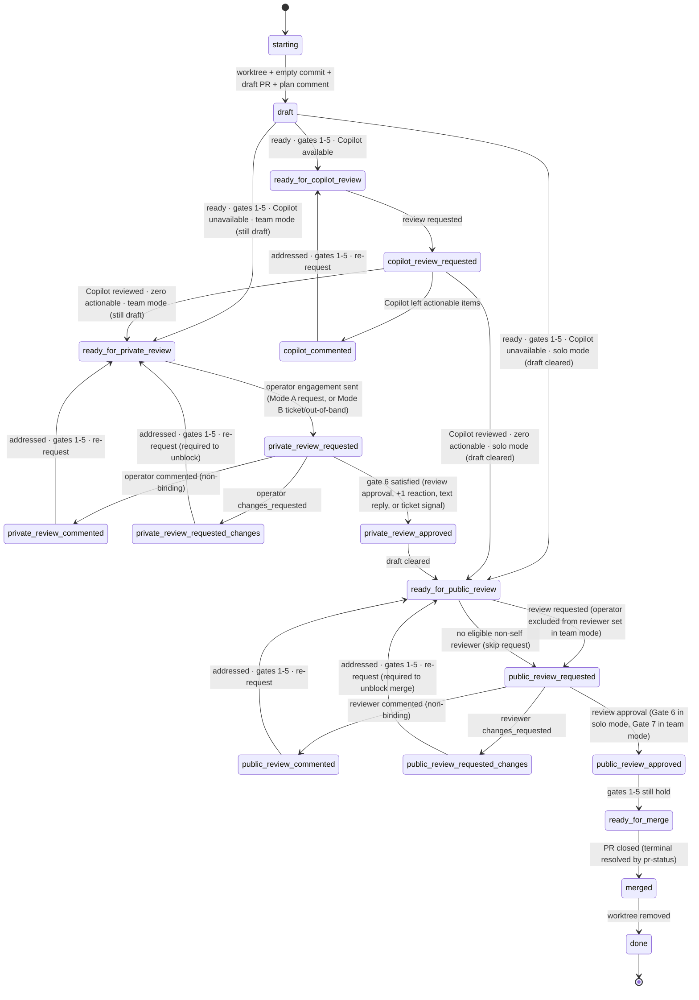

# deliver

Land a code change via a PR. On every tick: run `scripts/pr-status`, address every actionable concern, then evaluate exit gates to decide whether to transition.

The **operator** referenced below is the individual directing this agent — the only human with stop authority over it. Full role glossary (agent, operator, reviewer) in [`reference.md`](./reference.md#roles-1).

**Invoking `pr-status`.** The script requires `DISPATCH_AGENT_ID`, `DISPATCH_SKILL`, and `DISPATCH_OPERATOR_LOGIN`, and hard-fails (matching the calling-agent-identity posture) if any is unset. Before **every** invocation the agent MUST resolve the operator identity and pass it: use `operator_login` (`CLAUDE_PLUGIN_OPTION_OPERATOR_LOGIN`) if set; otherwise fall back to the ticket assigner. If neither is available, surface an actionable error rather than skipping the tick — the script cannot run without it.

## Setup

1. **Worktree.** Work inside `<worktree_base>/<owner>/<repo>/<branch>` (`worktree_base` is a `userConfig` value; default `~/.worktrees`). Find existing with `git worktree list` — never guess. Reuse if present.
2. **PR-open sequence** (skip if a PR is already open for this branch):
   - `git commit --allow-empty -m "chore: open PR [skip ci]"` — never amend or squash this commit.
   - Push; open a **draft** PR. Body: Motivation, Ticket link (omit entirely if none — bare IDs are non-conforming), Test plan. **No execution plan in the body.**
   - Post the plan as a top-level PR comment. Include `<!-- agent-plan:<agent-id> -->` inside the §2.1 body (after the machine marker / sparkle line, not before). Pin if supported.
3. **Resuming.** If a PR already exists: reuse worktree, skip the open sequence, find the existing plan comment by its `agent-plan` marker. If missing, post one. Never open a second PR; never retroactively rewrite the body.

## Gates

Seven binary signals read from each `pr-status` XML:

1. **CI.** `<checks state="passing">`. The protocol's rollup already treats `neutral`/`success` as passing and lets the repo suppress specific non-blocking checks via `informational="true"`.
2. **No conflicts.** `<merge-conflicts present="false"/>`.
3. **No actionable annotations.** Zero `<annotation actionable="true">`.
4. **No actionable comments.** Zero `<comment actionable="true">`.
5. **No actionable threads.** Zero `<thread actionable="true">`.
6. **Operator-approved.** Always required. Satisfied by any of:
   - A `<review mode="human" role="operator" state="approved">` in the pr-status XML (Mode A).
   - A `<reaction emoji="+1">` from the operator on the agent's engagement comment (the top-level comment carrying the current `<!-- agent-reply:<agent-id> -->` marker plus the `<!-- agent-engagement:<agent-id> -->` sentinel).
   - A "go ahead" / "lgtm" / explicit "ready" / "clear draft" reply from the operator on the engagement comment, on the ticket, or out-of-band — surfaced through the same channels the agent already monitors for actionability.
   - A ticket-side approval signal (e.g. status transition by the operator).

   In team mode, Gate 6 is satisfied during `private_review_*`. In solo mode, it is satisfied during `public_review_*`.
7. **Team-approved.** Required only in team mode. At least one `<review mode="human" role="team" state="approved">` from a non-self reviewer, and no current `changes_requested` from any reviewer. Satisfied during `public_review_*`. In solo mode Gate 7 is trivially satisfied (not evaluated).

Gates 1–5 are evaluated at every tick across every lifecycle state outside `starting`/`done`. **Gate failures are addressed in place — they do not change the state.** Only the conditions listed on each transition edge below trigger a state change.

## Lifecycle

States are named by **PR visibility**, not audience. `private_review_*` happens while the PR is still in draft (operator audience, team mode only). `public_review_*` happens after draft is cleared (operator audience in solo mode; non-operator team reviewers in team mode). The only mode-conditional edge is which state Copilot exits into.



`private_review_*` states are unreachable in solo mode. The agent clears draft on exactly one edge target: **any edge into `ready_for_public_review`**. In solo mode that is the edge out of `copilot_review_requested` (or `draft` when Copilot is unavailable). In team mode that is `private_review_approved → ready_for_public_review`. If the operator clicks "ready for review" themselves, the agent observes the same edge being fired by another actor and proceeds.

Universal terminal (not drawn, applies from every state): **PR closed** or **operator "stop" instruction** → read the resolved terminal from `pr-status`'s `<terminal>` element → acknowledge per §2.1 → `merged` → `done`. At closure `<terminal state>` is **binary** — it resolves *whether the change shipped*, not *how it was merged*:

- **`shipped`** — the change is present in base, regardless of who landed it or how (GitHub-merged, merge-queue fast-forward, or a squash/rebase landed by external tooling). Acknowledge as delivered (`Shipped.` / `rocket`). For a linked ticket, advance it to delivered/verified **only if this PR completes the ticket's remaining aims**; if the ticket needs further PRs (the §2.3 multi-PR rule forbids `delivered` until every required PR has landed), just record this PR as shipped and leave the ticket where it is.
- **`abandoned`** — closed with the change absent from base. Acknowledge as not-delivered and do **not** advance the linked ticket. If `<terminal>` carries an `error=` breadcrumb (the content check couldn't run), surface it so a human can reconcile — never claim delivery on a guess.

This includes the sole-reviewer case in team mode, where the explicit `public_review_approved → ready_for_merge → merged` path is unreachable and the merge fires the universal edge directly out of `public_review_requested`. Worktree cleanup happens on **any** closure, shipped or abandoned.

## States

| State                              | Do                                                                                                              | Poll?    |
| ---------------------------------- | --------------------------------------------------------------------------------------------------------------- | -------- |
| `starting`                         | Create or locate the worktree (§Setup).                                                                         | no       |
| `draft`                            | **Coding happens here.** Edit; pre-push review; push. When ready, check gates 1–5.                              | no       |
| `ready_for_copilot_review`         | Request Copilot review.                                                                                         | no       |
| `copilot_review_requested`         | Await Copilot's review.                                                                                         | CI       |
| `copilot_commented`                | Address each actionable Copilot item; push fix(es).                                                             | no       |
| `ready_for_private_review`         | (Team mode only.) Engage the operator while still in draft: post the engagement comment (agent-reply marker + `<!-- agent-engagement:<agent-id> -->` sentinel) and notify — Mode A: PR review request targeting `operator_login` (or ticket assigner fallback); Mode B: ticket/out-of-band per §Review rules. | no       |
| `private_review_requested`         | (Team mode only.) Await the operator's signal (review approval, +1 reaction, text reply, or ticket transition). | reviewer |
| `private_review_commented`         | (Team mode only.) Address each item; push; re-request.                                                          | no       |
| `private_review_requested_changes` | (Team mode only.) Address; push; **re-request required** — blocks public review until cleared.                  | no       |
| `private_review_approved`          | (Team mode only.) Clear draft; transition to `ready_for_public_review`.                                         | no       |
| `ready_for_public_review`          | Request public review. Solo mode: post the engagement comment (agent-reply + `agent-engagement` sentinel) and engage the operator (or ticket assigner). Team mode: request team reviewer(s), **excluding the operator**. Never self-request. Mode A/B per reference. | no       |
| `public_review_requested`          | Await the public reviewer.                                                                                      | reviewer |
| `public_review_commented`          | Address each item; push; re-request review.                                                                     | no       |
| `public_review_requested_changes`  | Address; push; **re-request required** — `changes_requested` blocks merge until cleared.                        | no       |
| `public_review_approved`           | Confirm gates 1–5 still hold; else fix in place.                                                                | no       |
| `ready_for_merge`                  | Await merge. **Don't self-merge unless instructed.**                                                            | merge    |
| `merged`                           | Read the resolved `<terminal>` from `pr-status`. **shipped** → acknowledge as delivered; advance a linked ticket to delivered/verified only if this PR completes its remaining aims, else just record the shipped PR (§2.3 multi-PR rule: intermediate PRs must not trigger `delivered`). **abandoned** → acknowledge as not-delivered, leave the ticket where it is (surface any `error=` breadcrumb). Either way, remove any worktree you created. | no       |
| `done`                             | Terminal.                                                                                                       | —        |

**Coding does NOT happen in:** `ready_for_copilot_review`, `copilot_review_requested`, `ready_for_private_review`, `private_review_requested`, `private_review_approved`, `ready_for_public_review`, `public_review_requested`, `public_review_approved`, `ready_for_merge`, `merged`, `done`. Code changes in those states are only legal as the response to a gate-1–5 failure (CI broke, conflict arose, a new actionable annotation/comment/thread appeared) — and that work is "addressing concerns in place," not advancing the lifecycle.

### Solo vs team mode

The `team_mode` userConfig (default `false`) selects between two delivery shapes:

- **Solo mode** (default). The operator is the only human reviewer. After Copilot the agent clears draft and engages the operator as the public reviewer directly. `private_review_*` is unreachable. Gate 6 is satisfied during `public_review_*`; Gate 7 is trivially satisfied.
- **Team mode**. The operator is one of several human reviewers and gets a private pre-review while the PR is still in draft. The agent clears draft only after the operator's approval (Gate 6, satisfied during `private_review_*`); then the rest of the team is engaged as public reviewers (Gate 7, satisfied during `public_review_*`). The operator is **excluded** from the public reviewer set in team mode.

**Self as sole eligible reviewer.** If no eligible non-self human reviewer exists in `ready_for_public_review`, the agent skips the request but still transitions to `public_review_requested` and keeps polling on the reviewer cadence. In solo mode the operator IS the binding reviewer through Gate 6 (satisfied via the non-formal-review signals in §Gates), so the sole-reviewer caveat from earlier revisions of this skill no longer applies. In team mode the caveat survives for Gate 7 only: if no non-self, non-operator reviewer exists, Gate 7 is unreachable, the PR is merged out-of-band, the agent observes closure on a poll, and the universal `merged → done` terminal fires. "Nobody to request from" is not a termination condition.

## Per-concern handling

Apply to every actionable item the XML emits, not just the first.

| XML signal                                            | Action                                                                  |
| ----------------------------------------------------- | ----------------------------------------------------------------------- |
| `<merge-conflicts present="true"/>` (gate 2 fails)    | Rebase or merge the target branch; resolve.                             |
| `<checks state="failing">` (gate 1 fails)             | Diagnose root cause; fix.                                               |
| Actionable `<comment>` or `<thread>` (gates 4–5 fail) | Reply and apply a terminal signal — never resolve the thread. See below. |
| Actionable `<annotation>` (gate 3 fails)              | Fix the code, OR dismiss with a `<cache>/$id.ack` carrying the rationale. |

For an actionable `<comment>` or `<thread>`: reply per §2.1 with **either** a
commit link describing what changed **or** a one-line dismissal rationale, then
apply a terminal signal. **Never resolve the thread** — not even one you opened;
resolution is a human's call (§2.1), and your terminal signal already suppresses
re-evaluation. For a dismissed `<annotation>`, capture the `.ack` rationale in
the plan comment or commit body.

## Cross-cutting behaviors

These apply in every state; they are not states themselves.

- **Read PR state only through `scripts/pr-status`.** Every gate evaluation and actionability decision comes from a `pr-status` XML snapshot and the on-disk cache it populates — never from `gh pr view`, `gh pr checks`, `gh api …/comments|/reviews`, or MCP PR reads. When you need a comment/thread/annotation's full text, read the cache file `pr-status` already wrote rather than re-fetching. Those ad-hoc status reads burn context and bypass the actionability rules. This isn't a blanket ban: if you must investigate something emergent the snapshot and cache don't cover, you may fetch that data directly — but the PR *status* you drive the lifecycle from comes only from `pr-status`, and your routine direct `gh`/MCP calls are *writes* (reply, request review, mark ready, react — never resolve threads, not even your own; that's a human's call, §2.1).
- **Pre-push review.** Before every significant push, run an adversarial review consisting of **two passes**:
  1. *Spec-aware* — given the relevant spec/docs **and** the PR contents (diff + commit messages), find every place the code drifts from what the spec mandates: missing required behavior, extra behavior the spec doesn't sanction, or behavior that conflicts with the spec.
  2. *Spec-blind* — given **only** the PR contents (diff + commit messages), with no spec or external docs, find every bug, internal inconsistency, or claim-vs-implementation gap (judged against the PR's own commit messages, identifiers, and in-diff comments).

  Use a **model family distinct from the one that authored the change** for both adversarial passes wherever the install has one configured (e.g. Codex via `codex:adversarial-review` / `codex:rescue` when the authoring agent is Claude). A second subagent on the authoring model with a different framing does NOT count as a distinct reviewer — the model family must differ. Only where no distinct model family is available may both passes fall back to subagents on the authoring model, one per framing above; that fallback is weaker and SHOULD trigger extra caution.

  Triage every finding (act, or one-line dismissal that names the finding being dismissed — readers of the PR won't see the underlying review output). Non-significant pushes (the empty `chore: open PR`, whitespace/format-only, trivial typo/lint fixes) skip pre-push review; if unsure, treat as significant.
- **Reply to every reviewer item.** Commit link or dismissal rationale. Silence is non-conforming. Human comments get more deference than bot ones.
- **Plan comment is the living plan.** Edit in place: check off completed steps, strike through abandoned ones with a one-line rationale (don't delete), append new ones. The PR body's Motivation and Test plan stay stable.
- **First green.** Gate 1 must be satisfied by a green CI rollup achieved _after_ the agent first attempts to leave `draft`. Greens on intermediate commits before that moment do not satisfy gate 1.
- **Heartbeats.** While polling, emit INFO heartbeats per §2.3 (`ticket=-` when there is no linked ticket).
- **Termination is narrow.** Plan completion, green CI, review requests, `ready_for_merge`, and "nobody to request review from" do not terminate. Only PR closure or explicit operator "stop" terminates. The agent runs the lifecycle through itself — see §Polling/Mechanism — and is never re-prodded by a caller (operator or orchestrator) to make forward progress.
- **Re-derive termination each tick.** Decide termination from the current `pr-status` read; never carry "if X then stop" conditions across ticks. The loop amplifies them, and only the narrow list above is grounds for stopping.

## Polling

Adaptive, not fixed. Build project memory and use it to dodge unnecessary traffic. **Never poll faster than once per minute.**

| Waiting on                             | Schedule                                                                                 |
| -------------------------------------- | ---------------------------------------------------------------------------------------- |
| CI (`<checks state="pending">`)        | 60 s. Lengthen to ~5 min once past the project's typical CI duration without completion. |
| Reviewer reply after a request         | 5 min for the first hour; then 30 min.                                                   |
| Merge after reaching `ready_for_merge` | 5 min for the first hour; then 30 min.                                                   |

### Mechanism

The agent is the poll loop. Polling is done by the agent itself, inline, via sequential foreground tool calls — typically `Bash` `sleep` followed by a `pr-status` re-read and any reactive work the new state requires. The agent stays continuously active in its current turn until a lifecycle terminal (see "Termination is narrow"); it does not yield its turn back to a caller, hand off to a wakeup, or expect anyone to re-prod it. This holds whether `deliver` is invoked directly by an operator or dispatched as a subagent (e.g. `linear-project`'s `deliver-worker`).

For waits longer than the Bash tool timeout (~10 min), do **not** use a single long `sleep`. Split into shorter intervals — a 30-minute reviewer wait becomes ~5×6-minute `sleep`s, each followed by a cheap `pr-status` check. Re-checking more often than the schedule above is fine; the table is an upper bound on the wait, not a lower bound on the loop.

Forbidden patterns (each has been observed to silently strand a PR mid-lifecycle):

- **Detached background poll loops.** Any `run_in_background: true` Bash whose body repeats `touch <lock>; sleep; poll` in any form — `while true`, `until`, plain `touch; sleep; touch` triplets, `nohup`, `disown`, etc. Spawning a detached loop and then exhausting the agent's tool calls leaves the OS process polling indefinitely while the agent itself is reaped; the lock keeps heartbeating forever even though no reactive work can happen, and the PR sits orphaned with the `agent-working` signal still set.
- **Suspending on `Monitor`** as the poll vehicle. The harness's armed-monitor pattern observably fails to wake long polls — the agent yields, the wake never fires, the PR is silently unmonitored. Stay in-turn with foreground `sleep`s instead.
- **Ending the turn before a lifecycle terminal.** Returning early — for "no actionable work right now," for "the caller will check back," or any reason short of merged / closed / explicit operator "stop" — orphans the PR. The corresponding instruction to a caller is: **do not design the caller around mid-lifecycle re-dispatch.** A live `deliver` agent is expected to be doing the work.

When the agent reaches a lifecycle terminal, or exits in response to an explicit operator "stop" it can catch, it runs whatever cleanup the dispatch brief specifies (lock file removal, `agent-working` label removal, status file write). Abnormal exits (API errors, OOM, harness reaping) are out of the agent's reach; the caller's stale-state sweep is the backstop for those, not a substitute for the agent's discipline.

### Project memory

Maintain a small history file at `<cache-base>/<skill>/<repo-slug>/_history.jsonl`. On every observed wait, append one line:

```json
{ "ts": "...", "kind": "ci|reviewer|merge", "elapsed_s": 0, "outcome": "..." }
```

On entry to a polling state, read the median `elapsed_s` for that kind and tune the schedule above: shorten the head when CI is typically fast; lengthen the tail when reviewers are typically slow. Cap the history at the most recent ~100 entries per kind.

## Configuration

Read from the plugin's `userConfig` (env: `CLAUDE_PLUGIN_OPTION_*`):

| Key                 | Effect                                                                                                                                                                                                                                              |
| ------------------- | --------------------------------------------------------------------------------------------------------------------------------------------------------------------------------------------------------------------------------------------------- |
| `copilot_available` | `false` → skip the Copilot phase entirely: `draft → ready_for_public_review` (solo) or `draft → ready_for_private_review` (team) directly. Default `true`.                                                                                          |
| `worktree_base`     | Root directory for per-PR worktrees. Layout: `<base>/<owner>/<repo>/<branch>`. Default `~/.worktrees`.                                                                                                                                              |
| `team_mode`         | `true` → operator is one of several reviewers; insert `private_review_*` stage in draft (operator audience) before clearing draft for `public_review_*` (team audience). `false` (default) → operator IS the public reviewer; no private stage.     |
| `operator_login`    | GitHub login of the operator. Used in Mode A to target the operator for PR review requests and to classify `<review>` elements (`role="operator"` vs `"team"`) in pr-status XML. If unset, falls back to the ticket assigner. Ignored in Mode B.    |

## References

The bits this skill leans on — Mode A/B detection, the machine marker and
sparkle wrapper, terminal signals, actionability, and the operational-log line
format — are condensed in [`reference.md`](./reference.md), bundled so the skill
is self-contained once installed. That file points back to the full dispatch
spec (§2.1 Communication, §2.2 PR Status, §2.3 Logging, §2.4 Delivery) where the
two differ.
