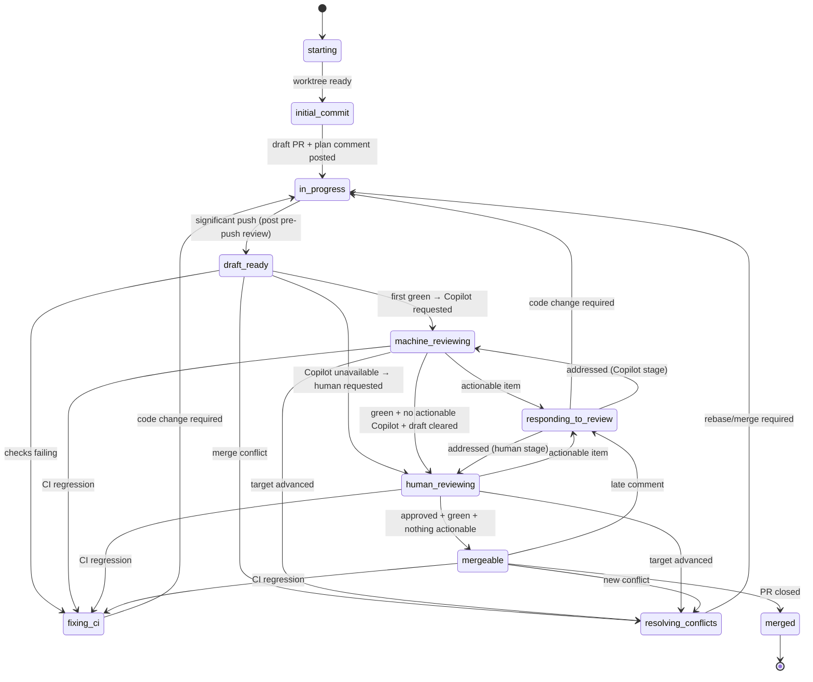

# deliver

Land a code change via a PR. Loop on PR state until close.

## Setup

1. **Worktree.** Work inside `~/.worktrees/<owner>/<repo>/<branch>` (or repo override). Find existing with `git worktree list` — never guess. Reuse if present.
2. **PR-open sequence** (skip if a PR is already open for this branch):
   - `git commit --allow-empty -m "chore: open PR [skip ci]"` — never amend or squash this commit.
   - Push; open a **draft** PR. Body: Motivation, Ticket link (omit entirely if none — bare IDs are non-conforming), Test plan. **No execution plan in the body.**
   - Post the plan as a top-level PR comment. Include `<!-- agent-plan:<agent-id> -->` inside the §2.1 body (after the machine marker / sparkle line, not before). Pin if supported.
3. **Resuming.** If a PR already exists: reuse worktree, skip the open sequence, find the existing plan comment by its `agent-plan` marker. If missing, post one. Never open a second PR; never retroactively rewrite the body.

## Lifecycle

Concerns can co-occur. A single iteration may resolve a conflict, fix CI, and respond to feedback together before transitioning.

## Each iteration

1. Run `scripts/pr-status <pr>` with `DISPATCH_AGENT_ID` and `DISPATCH_SKILL=deliver` in env.
2. **Address every actionable concern the XML emits**, not just the first. Use the per-concern table below.
3. Before any significant push, run **simplify** + an adversarial review by a distinct reviewer. Triage every finding (act or record a one-line dismissal). Push.
4. After acting, re-run `pr-status`. Apply the stage-transition table to decide the next state. If the only outstanding state is "waiting," poll per the cadences below.

### Per-concern handling

| XML signal                                              | Action                                                                                                                                                  |
| ------------------------------------------------------- | ------------------------------------------------------------------------------------------------------------------------------------------------------- |
| `<merge-conflicts present="true"/>`                     | Rebase or merge the target branch; resolve; push.                                                                                                       |
| `<checks state="failing">` with non-informational fails | Diagnose root cause. Fix. Pre-push review. Push.                                                                                                        |
| Actionable `<comment>`                                  | Reply per §2.1 with **either** a commit link describing what changed **or** a one-line dismissal rationale. Apply terminal signal.                      |
| Actionable `<thread>`                                   | Same as `<comment>`. Resolve the thread when satisfied.                                                                                                 |
| Actionable `<annotation>`                               | Fix the code, OR dismiss by writing `<cache>/$id.ack` with the rationale captured in the plan comment or commit body.                                   |

### Stage transitions

| Picture after addressing concerns                                                | Move to                                                                                                                      |
| -------------------------------------------------------------------------------- | ---------------------------------------------------------------------------------------------------------------------------- |
| No commits beyond `chore: open PR`                                               | `in_progress` — implement.                                                                                                   |
| Significant push just landed, change is "ready"                                  | `draft_ready` — poll for first green.                                                                                        |
| First green achieved, no Copilot review yet, Copilot available                   | Request Copilot review → `machine_reviewing`.                                                                                |
| First green achieved, Copilot unavailable on this installation                   | Clear draft; request human review → `human_reviewing`.                                                                       |
| `machine_reviewing`, zero actionable Copilot items, green CI, still draft        | Clear draft; request human review → `human_reviewing`. Mode A: GitHub review request. Mode B: tag human on the ticket.       |
| `human_reviewing`, approved + green + nothing actionable                         | `mergeable` — poll for merge.                                                                                                |
| PR merged or closed, or human says "stop"                                        | `merged` (terminal). Acknowledge per §2.1. Remove any worktree **you** created. Exit.                                        |

### Polling

When the only outstanding state is waiting, poll `pr-status` on an interval. Between polls, emit an INFO heartbeat per §2.3 (`ticket=-` when there is no linked ticket).

| Waiting on                              | Cadence  |
| --------------------------------------- | -------- |
| CI (`<checks state="pending">`)         | 30–60 s  |
| Reviewer reply after a request          | 5 min    |
| Merge after reaching `mergeable`        | 5 min    |

## Rules

- **First green** = a green CI rollup reached *after* you decided the change is ready. Greens on intermediate commits don't count.
- **Significant push** triggers the pre-push review pair (simplify + adversarial). Non-significant: empty `chore: open PR`, whitespace/format-only, trivial typo/lint fixes. If unsure, treat as significant.
- **Plan comment** is the living plan: edit in place. Check off completed steps, strike through abandoned ones with a one-line rationale (don't delete), append new ones. The PR body's Motivation and Test plan stay stable.
- **Every reviewer comment gets a reply** — commit link or dismissal rationale. Silence is non-conforming. Give human comments more deference than bots'.
- **Termination is narrow.** Do not stop because the plan is done, CI is green, review was requested, or the PR is `mergeable`. Only PR close or an explicit human "stop" terminates.

## References

- §2.4.2 Delivery Protocol
- §2.2.2 PR Status Protocol
- §2.1.2 Communication Protocol (machine marker, Mode A/B sparkle wrapper, terminal signals)
- §2.3 Operational logging (heartbeats, `TRANSITION` entries)
