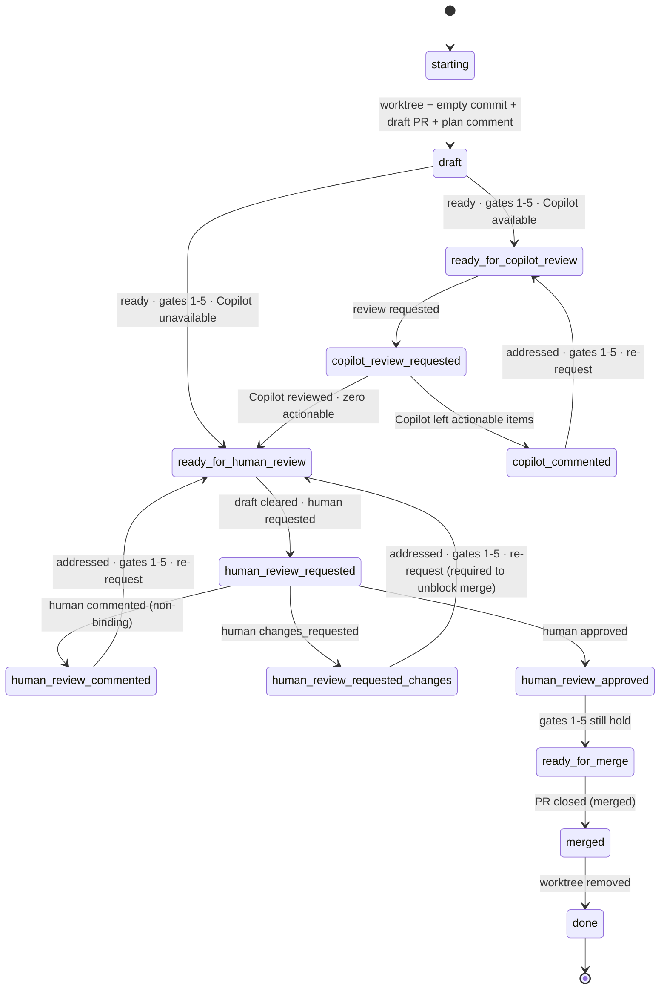

# deliver

Land a code change via a PR. On every tick: run `scripts/pr-status`, address every actionable concern, then evaluate exit gates to decide whether to transition.

## Setup

1. **Worktree.** Work inside `<worktree_base>/<owner>/<repo>/<branch>` (`worktree_base` is a `userConfig` value; default `~/.worktrees`). Find existing with `git worktree list` — never guess. Reuse if present.
2. **PR-open sequence** (skip if a PR is already open for this branch):
   - `git commit --allow-empty -m "chore: open PR [skip ci]"` — never amend or squash this commit.
   - Push; open a **draft** PR. Body: Motivation, Ticket link (omit entirely if none — bare IDs are non-conforming), Test plan. **No execution plan in the body.**
   - Post the plan as a top-level PR comment. Include `<!-- agent-plan:<agent-id> -->` inside the §2.1 body (after the machine marker / sparkle line, not before). Pin if supported.
3. **Resuming.** If a PR already exists: reuse worktree, skip the open sequence, find the existing plan comment by its `agent-plan` marker. If missing, post one. Never open a second PR; never retroactively rewrite the body.

## Gates

Six binary signals read from each `pr-status` XML:

1. **CI.** `<checks state="passing">`. The protocol's rollup already treats `neutral`/`success` as passing and lets the repo suppress specific non-blocking checks via `informational="true"`.
2. **No conflicts.** `<merge-conflicts present="false"/>`.
3. **No actionable annotations.** Zero `<annotation actionable="true">`.
4. **No actionable comments.** Zero `<comment actionable="true">`.
5. **No actionable threads.** Zero `<thread actionable="true">`.
6. **Human-approved.** At least one `<review mode="human" state="approved">` from a non-self reviewer, and no current `changes_requested` from any reviewer.

Gates 1–5 are evaluated at every tick across every lifecycle state outside `starting`/`done`. **Gate failures are addressed in place — they do not change the state.** Only the conditions listed on each transition edge below trigger a state change.

## Lifecycle



Universal terminal (not drawn, applies from every state): **PR closed without merging** or **human "stop" instruction** → acknowledge per §2.1 → `merged` → `done`. Worktree cleanup happens on **any** closure, not only on a successful merge.

## States

| State                            | Do                                                                                       | Poll?    |
| -------------------------------- | ---------------------------------------------------------------------------------------- | -------- |
| `starting`                       | Create or locate the worktree (§Setup).                                                  | no       |
| `draft`                          | **Coding happens here.** Edit; pre-push review; push. When ready, check gates 1–5.       | no       |
| `ready_for_copilot_review`       | Request Copilot review.                                                                  | no       |
| `copilot_review_requested`       | Await Copilot's review.                                                                  | CI       |
| `copilot_commented`              | Address each actionable Copilot item; push fix(es).                                      | no       |
| `ready_for_human_review`         | Clear draft; request human(s). Never self-request. Mode A/B per reference.               | no       |
| `human_review_requested`         | Await a human review.                                                                    | reviewer |
| `human_review_commented`         | Address each item; push; re-request review.                                              | no       |
| `human_review_requested_changes` | Address; push; **re-request required** — `changes_requested` blocks merge until cleared. | no       |
| `human_review_approved`          | Confirm gates 1–5 still hold; else fix in place.                                         | no       |
| `ready_for_merge`                | Await merge. **Don't self-merge unless instructed.**                                     | merge    |
| `merged`                         | Acknowledge (§2.1); remove any worktree you created.                                     | no       |
| `done`                           | Terminal.                                                                                | —        |

**Coding does NOT happen in:** `ready_for_copilot_review`, `copilot_review_requested`, `ready_for_human_review`, `human_review_requested`, `human_review_approved`, `ready_for_merge`, `merged`, `done`. Code changes in those states are only legal as the response to a gate-1–5 failure (CI broke, conflict arose, a new actionable annotation/comment/thread appeared) — and that work is "addressing concerns in place," not advancing the lifecycle.

## Per-concern handling

Apply to every actionable item the XML emits, not just the first.

| XML signal                                            | Action                                                                                                                                                             |
| ----------------------------------------------------- | ------------------------------------------------------------------------------------------------------------------------------------------------------------------ |
| `<merge-conflicts present="true"/>` (gate 2 fails)    | Rebase or merge the target branch; resolve.                                                                                                                        |
| `<checks state="failing">` (gate 1 fails)             | Diagnose root cause; fix.                                                                                                                                          |
| Actionable `<comment>` or `<thread>` (gates 4–5 fail) | Reply per §2.1 with **either** a commit link describing what changed **or** a one-line dismissal rationale. Apply terminal signal. Resolve threads when satisfied. |
| Actionable `<annotation>` (gate 3 fails)              | Fix the code, OR dismiss by writing `<cache>/$id.ack` with the rationale captured in the plan comment or commit body.                                              |

## Cross-cutting behaviors

These apply in every state; they are not states themselves.

- **Pre-push review.** Before every significant push: simplify pass + adversarial pass by a distinct reviewer. Triage every finding (act or one-line dismissal). Non-significant pushes (the empty `chore: open PR`, whitespace/format-only, trivial typo/lint fixes) skip pre-push review; if unsure, treat as significant.
- **Reply to every reviewer item.** Commit link or dismissal rationale. Silence is non-conforming. Human comments get more deference than bot ones.
- **Plan comment is the living plan.** Edit in place: check off completed steps, strike through abandoned ones with a one-line rationale (don't delete), append new ones. The PR body's Motivation and Test plan stay stable.
- **First green.** Gate 1 must be satisfied by a green CI rollup achieved _after_ the agent first attempts to leave `draft`. Greens on intermediate commits before that moment do not satisfy gate 1.
- **Heartbeats.** While polling, emit INFO heartbeats per §2.3 (`ticket=-` when there is no linked ticket).
- **Lifecycle termination is narrow.** Plan completion, green CI, review requests, and `ready_for_merge` do not end the *lifecycle* — only PR closure or explicit human "stop" does. Turn termination is separate and routine; see §Polling/Mechanism.

## Polling

Adaptive, not fixed. Build project memory and use it to dodge unnecessary traffic. **Never poll faster than once per minute.**

| Waiting on                             | Schedule                                                                                 |
| -------------------------------------- | ---------------------------------------------------------------------------------------- |
| CI (`<checks state="pending">`)        | 60 s. Lengthen to ~5 min once past the project's typical CI duration without completion. |
| Reviewer reply after a request         | 5 min for the first hour; then 30 min.                                                   |
| Merge after reaching `ready_for_merge` | 5 min for the first hour; then 30 min.                                                   |

### Mechanism

Polling must terminate when the agent's turn does. Lifecycle termination is narrow (PR closure or human "stop"), but **turn termination is normal** — any time the only remaining action is to wait, end the turn cleanly. The skill is resumable from PR state alone: every lifecycle state in §Lifecycle reconstructs from a fresh `pr-status` read, so an `/loop` tick, a `ScheduleWakeup`, or a manual re-invocation all resume identically.

Three supported wait patterns, in order of preference:

| Pattern                            | When                                                                                                                                                       |
| ---------------------------------- | ---------------------------------------------------------------------------------------------------------------------------------------------------------- |
| End the turn; caller re-dispatches | Default when invoked from a tick-driven caller (e.g. `linear-project`'s `/loop`). The caller's next tick re-reads PR state and re-enters.                  |
| `ScheduleWakeup` + end the turn    | Standalone runs with no external tick driver. Schedule a wakeup that re-invokes this skill; close the turn.                                                |
| Inline foreground `Bash` `sleep`   | Short waits (≤ ~5 min, comfortably under the Bash tool timeout) where ending the turn would lose more than it saves (e.g. mid-burst CI ack/recheck cycle). |

Forbidden patterns (each has bitten this skill in production):

- **Detached background poll loops.** Any `run_in_background: true` Bash whose body repeats `touch <lock>; sleep; poll` in any form — `while true`, `until`, plain `touch; sleep; touch` triplets, `nohup`, `disown`, etc. The loop becomes a raw OS process that survives the agent's task completion, keeps any heartbeat file fresh indefinitely, and breaks the invariant that turn-end means polling-stopped — corrupting every liveness signal a stateless caller can use to detect a dead worker.
- **Suspending on `Monitor`** as the poll vehicle. The harness's armed-monitor pattern observably fails to wake long polls; the agent yields, the wake-up never fires, the PR is silently unmonitored. Use `ScheduleWakeup` instead.

Whether the turn ends at a wait boundary or at a lifecycle terminal, **the same cleanup runs**: anything the skill acquired this turn, plus any caller-imposed cleanup specified in the dispatch brief (lock file, `agent-working` label, status file). A turn that ends without running cleanup leaves the PR in a half-tracked state that the caller can only recover via its own stale-state sweep.

### Project memory

Maintain a small history file at `<cache-base>/<skill>/<repo-slug>/_history.jsonl`. On every observed wait, append one line:

```json
{ "ts": "...", "kind": "ci|reviewer|merge", "elapsed_s": 0, "outcome": "..." }
```

On entry to a polling state, read the median `elapsed_s` for that kind and tune the schedule above: shorten the head when CI is typically fast; lengthen the tail when reviewers are typically slow. Cap the history at the most recent ~100 entries per kind.

## Configuration

Read from the plugin's `userConfig` (env: `CLAUDE_PLUGIN_OPTION_*`):

| Key                 | Effect                                                                                                 |
| ------------------- | ------------------------------------------------------------------------------------------------------ |
| `copilot_available` | `false` → skip the Copilot phase entirely: `draft → ready_for_human_review` directly. Default `true`.  |
| `worktree_base`     | Root directory for per-PR worktrees. Layout: `<base>/<owner>/<repo>/<branch>`. Default `~/.worktrees`. |

## References

The bits this skill leans on — Mode A/B detection, the machine marker and
sparkle wrapper, terminal signals, actionability, and the operational-log line
format — are condensed in [`reference.md`](./reference.md), bundled so the skill
is self-contained once installed. That file points back to the full dispatch
spec (§2.1 Communication, §2.2 PR Status, §2.3 Logging, §2.4 Delivery) where the
two differ.
