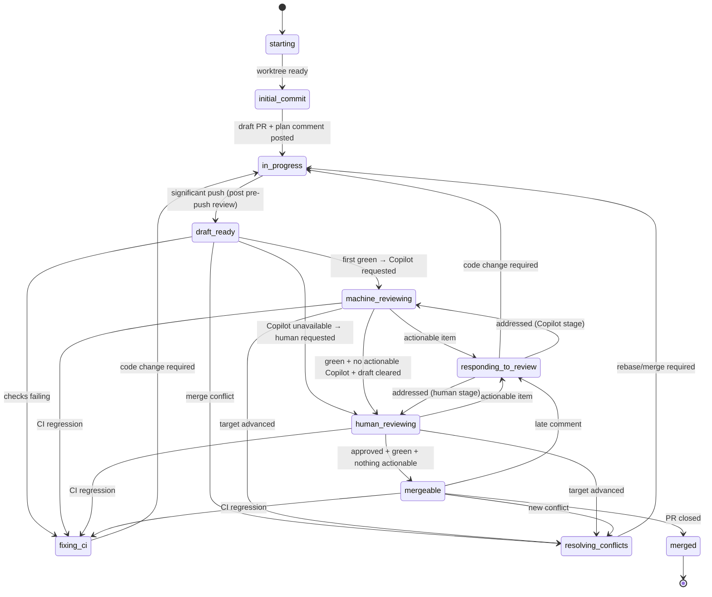

# deliver

Land a code change via a PR. Loop on PR state until close.

## Setup

1. **Worktree.** Work inside `~/.worktrees/<owner>/<repo>/<branch>` (or repo override). Find existing with `git worktree list` — never guess. Reuse if present.
2. **PR-open sequence** (skip if a PR is already open for this branch):
   - `git commit --allow-empty -m "chore: open PR [skip ci]"` — never amend or squash this commit.
   - Push; open a **draft** PR. Body: Motivation, Ticket link (omit entirely if none — bare IDs are non-conforming), Test plan. **No execution plan in the body.**
   - Post the plan as a top-level PR comment. Include `<!-- agent-plan:<agent-id> -->` inside the §2.1 body (after the machine marker / sparkle line, not before). Pin if supported.
3. **Resuming.** If a PR already exists: reuse worktree, skip the open sequence, find the existing plan comment by its `agent-plan` marker. If missing, post one. Never open a second PR; never retroactively rewrite the body.

## Lifecycle



Concerns can co-occur. A single iteration may resolve a conflict, fix CI, and respond to feedback together before transitioning.

## Each iteration

1. Run `scripts/pr-status <pr>` with `DISPATCH_AGENT_ID` and `DISPATCH_SKILL=deliver` in env.
2. **Address every actionable concern the XML emits**, not just the first. Use the per-concern table below.
3. Before any significant push, run **simplify** + an adversarial review by a distinct reviewer. Triage every finding (act or record a one-line dismissal). Push.
4. Re-run `pr-status`. Identify your current state in the table below, apply its `Do` step, then take whichever `Exit` matches the new picture.

## States

Rows mirror the lifecycle diagram 1:1. In each state, do the listed work, then take the first matching exit. Resuming on an existing PR: start in whatever state the live PR's `pr-status` describes (commonly `in_progress`, `machine_reviewing`, or `human_reviewing`).

| State                  | Do                                                                                  | Exits                                                                                                                                                                                       |
| ---------------------- | ----------------------------------------------------------------------------------- | ------------------------------------------------------------------------------------------------------------------------------------------------------------------------------------------- |
| `starting`             | Locate or create the worktree per §Setup.                                           | worktree ready → `initial_commit`                                                                                                                                                           |
| `initial_commit`       | Empty `chore: open PR [skip ci]` commit · push · open draft PR · post plan comment. | → `in_progress`                                                                                                                                                                             |
| `in_progress`          | Implement code changes.                                                             | significant push (after pre-push review) → `draft_ready`                                                                                                                                    |
| `draft_ready`          | Poll for first green (§Polling).                                                    | failing → `fixing_ci` · conflict → `resolving_conflicts` · **first green** → `machine_reviewing` (or `human_reviewing` if Copilot unavailable)                                              |
| `machine_reviewing`    | On entry: request Copilot review. Then poll for Copilot activity.                   | actionable item → `responding_to_review` · zero actionable Copilot items + green + draft cleared → `human_reviewing` · failing → `fixing_ci` · conflict → `resolving_conflicts`             |
| `human_reviewing`      | On entry: clear draft + request human (Mode A: GitHub request; Mode B: tag on ticket). Then poll. | actionable item → `responding_to_review` · approved + green + nothing actionable → `mergeable` · failing → `fixing_ci` · conflict → `resolving_conflicts`                       |
| `responding_to_review` | Apply per-concern table to every actionable item.                                   | code change required → `in_progress` · all replied during Copilot stage → `machine_reviewing` · all replied during human stage → `human_reviewing`                                          |
| `fixing_ci`            | Diagnose root cause; prepare fix.                                                   | → `in_progress`                                                                                                                                                                             |
| `resolving_conflicts`  | Rebase or merge target.                                                             | → `in_progress`                                                                                                                                                                             |
| `mergeable`            | Poll for merge.                                                                     | failing → `fixing_ci` · conflict → `resolving_conflicts` · late actionable item → `responding_to_review` · PR closed → `merged`                                                             |
| `merged`               | Acknowledge per §2.1; remove any worktree **you** created.                          | terminal                                                                                                                                                                                    |

A human "stop" instruction terminates from any state: acknowledge per §2.1, remove your worktree, exit.

### Per-concern handling

Use inside `fixing_ci`, `resolving_conflicts`, `responding_to_review`. Address every concern in the XML in a single pass, not just the first.

| XML signal                                              | Action                                                                                                                              |
| ------------------------------------------------------- | ----------------------------------------------------------------------------------------------------------------------------------- |
| `<merge-conflicts present="true"/>`                     | Rebase or merge the target branch; resolve.                                                                                         |
| `<checks state="failing">` with non-informational fails | Diagnose root cause; fix.                                                                                                           |
| Actionable `<comment>` or `<thread>`                    | Reply per §2.1 with **either** a commit link describing what changed **or** a one-line dismissal rationale. Apply terminal signal. Resolve threads when satisfied. |
| Actionable `<annotation>`                               | Fix the code, OR dismiss by writing `<cache>/$id.ack` with the rationale captured in the plan comment or commit body.               |

## Polling

Adaptive, not fixed. Build project memory and use it to dodge unnecessary traffic.

| Waiting on                              | Schedule                                                                                                                                            |
| --------------------------------------- | --------------------------------------------------------------------------------------------------------------------------------------------------- |
| CI (`<checks state="pending">`)         | 15 s for the first 2 min (build-step failures usually surface here); then 60 s; then tighten back to 15 s once within ~2 min of the project's typical CI duration. |
| Reviewer reply after a request          | 5 min for the first hour; then 30 min.                                                                                                              |
| Merge after reaching `mergeable`        | 5 min for the first hour; then 30 min.                                                                                                              |

Between polls, emit an INFO heartbeat per §2.3 (`ticket=-` when there is no linked ticket).

### Project memory

Maintain a small history file at `<cache-base>/<skill>/<repo-slug>/_history.jsonl`. On every observed wait, append one line:

```json
{ "ts": "...", "kind": "ci|reviewer|merge", "elapsed_s": 0, "outcome": "..." }
```

On entry to a polling state, read the median `elapsed_s` for that kind and tune the schedule above: shorten the head when CI is typically fast; lengthen the tail when reviewers are typically slow. Cap the history at the most recent ~100 entries per kind.

## Rules

- **First green** = a green CI rollup reached *after* you decided the change is ready. Greens on intermediate commits don't count.
- **Significant push** triggers the pre-push review pair (simplify + adversarial). Non-significant: empty `chore: open PR`, whitespace/format-only, trivial typo/lint fixes. If unsure, treat as significant.
- **Plan comment** is the living plan: edit in place. Check off completed steps, strike through abandoned ones with a one-line rationale (don't delete), append new ones. The PR body's Motivation and Test plan stay stable.
- **Every reviewer comment gets a reply** — commit link or dismissal rationale. Silence is non-conforming. Give human comments more deference than bots'.
- **Termination is narrow.** Do not stop because the plan is done, CI is green, review was requested, or the PR is `mergeable`. Only PR close or an explicit human "stop" terminates.

## References

- §2.4.2 Delivery Protocol
- §2.2.2 PR Status Protocol
- §2.1.2 Communication Protocol (machine marker, Mode A/B sparkle wrapper, terminal signals)
- §2.3 Operational logging (heartbeats, `TRANSITION` entries)
