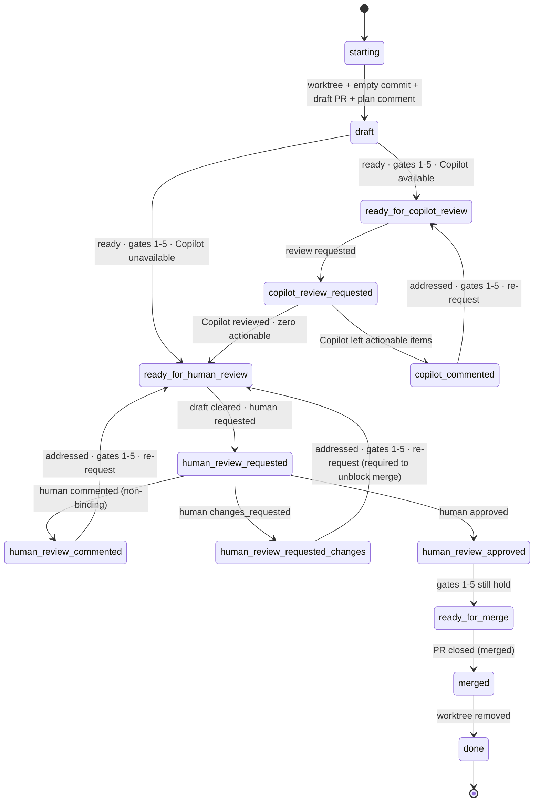

# deliver

Land a code change via a PR. On every tick: run `scripts/pr-status`, address every actionable concern, then evaluate exit gates to decide whether to transition.

## Setup

1. **Worktree.** Work inside `~/.worktrees/<owner>/<repo>/<branch>` (or repo override). Find existing with `git worktree list` — never guess. Reuse if present.
2. **PR-open sequence** (skip if a PR is already open for this branch):
   - `git commit --allow-empty -m "chore: open PR [skip ci]"` — never amend or squash this commit.
   - Push; open a **draft** PR. Body: Motivation, Ticket link (omit entirely if none — bare IDs are non-conforming), Test plan. **No execution plan in the body.**
   - Post the plan as a top-level PR comment. Include `<!-- agent-plan:<agent-id> -->` inside the §2.1 body (after the machine marker / sparkle line, not before). Pin if supported.
3. **Resuming.** If a PR already exists: reuse worktree, skip the open sequence, find the existing plan comment by its `agent-plan` marker. If missing, post one. Never open a second PR; never retroactively rewrite the body.

## Gates

Six binary signals read from each `pr-status` XML:

1. **CI.** `<checks state="passing">` (failures from `informational="true"` checks don't count).
2. **No conflicts.** `<merge-conflicts present="false"/>`.
3. **No actionable annotations.** Zero `<annotation actionable="true">`.
4. **No actionable comments.** Zero `<comment actionable="true">`.
5. **No actionable threads.** Zero `<thread actionable="true">`.
6. **Human-approved.** At least one `<review mode="human" state="approved">` from a non-self reviewer, and no current `changes_requested` from any reviewer.

Gates 1–5 are evaluated at every tick across every lifecycle state outside `starting`/`done`. **Gate failures are addressed in place — they do not change the state.** Only the conditions listed on each transition edge below trigger a state change.

## Lifecycle



Universal terminal (not drawn, applies from every state): **PR closed without merging** or **human "stop" instruction** → acknowledge per §2.1 → `merged` → `done`. Worktree cleanup happens on **any** closure, not only on a successful merge.

## States

| State                            | Do                                                                                                                                                | Wait/poll? |
| -------------------------------- | ------------------------------------------------------------------------------------------------------------------------------------------------- | ---------- |
| `starting`                       | One-shot: create or locate the worktree per §Setup.                                                                                               | no         |
| `draft`                          | **Implementation phase — this is where coding happens.** Edit; run pre-push review pair (simplify + adversarial); push. When you decide the change is ready, evaluate gates 1–5.    | no         |
| `ready_for_copilot_review`       | Transient. Request Copilot review on the PR.                                                                                                      | no         |
| `copilot_review_requested`       | Wait for Copilot to submit a review.                                                                                                              | yes (CI cadence) |
| `copilot_commented`              | Address every actionable Copilot item per the per-concern table. Push fix(es).                                                                    | no         |
| `ready_for_human_review`         | Transient. Clear draft state; request specific human(s). Mode A: GitHub review request. Mode B: tag the human on the ticket. Never request from yourself. | no |
| `human_review_requested`         | Wait for a human review submission.                                                                                                                | yes (reviewer cadence) |
| `human_review_commented`         | Address every actionable item from the human review. Push. Re-request human review.                                                               | no         |
| `human_review_requested_changes` | Address items. Push. **Re-request review is required** — `changes_requested` blocks merge until the reviewer dismisses or re-submits.             | no         |
| `human_review_approved`          | Evaluate gates 1–5. They must still hold; if not, address concerns in place until they do.                                                        | no         |
| `ready_for_merge`                | Wait for merge. **Do not merge yourself unless explicitly instructed.**                                                                            | yes (merge cadence) |
| `merged`                         | Acknowledge per §2.1. Remove any worktree **you** created (on any closure, merged or not).                                                        | no         |
| `done`                           | Terminal.                                                                                                                                          | —          |

**Coding does NOT happen in:** `ready_for_copilot_review`, `copilot_review_requested`, `ready_for_human_review`, `human_review_requested`, `human_review_approved`, `ready_for_merge`, `merged`, `done`. Code changes in those states are only legal as the response to a gate-1–5 failure (CI broke, conflict arose, a new actionable annotation/comment/thread appeared) — and that work is "addressing concerns in place," not advancing the lifecycle.

## Per-concern handling

Apply to every actionable item the XML emits, not just the first.

| XML signal                                              | Action                                                                                                                                  |
| ------------------------------------------------------- | --------------------------------------------------------------------------------------------------------------------------------------- |
| `<merge-conflicts present="true"/>` (gate 2 fails)      | Rebase or merge the target branch; resolve.                                                                                             |
| `<checks state="failing">` (gate 1 fails)               | Diagnose root cause; fix.                                                                                                               |
| Actionable `<comment>` or `<thread>` (gates 4–5 fail)   | Reply per §2.1 with **either** a commit link describing what changed **or** a one-line dismissal rationale. Apply terminal signal. Resolve threads when satisfied. |
| Actionable `<annotation>` (gate 3 fails)                | Fix the code, OR dismiss by writing `<cache>/$id.ack` with the rationale captured in the plan comment or commit body.                   |

## Cross-cutting behaviors

These apply in every state; they are not states themselves.

- **Pre-push review.** Before every significant push: simplify pass + adversarial pass by a distinct reviewer. Triage every finding (act or one-line dismissal). Non-significant pushes (the empty `chore: open PR`, whitespace/format-only, trivial typo/lint fixes) skip pre-push review; if unsure, treat as significant.
- **Reply to every reviewer item.** Commit link or dismissal rationale. Silence is non-conforming. Human comments get more deference than bot ones.
- **Plan comment is the living plan.** Edit in place: check off completed steps, strike through abandoned ones with a one-line rationale (don't delete), append new ones. The PR body's Motivation and Test plan stay stable.
- **First green.** Gate 1 must be satisfied by a green CI rollup achieved *after* the agent first attempts to leave `draft`. Greens on intermediate commits before that moment do not satisfy gate 1.
- **Heartbeats.** While polling, emit INFO heartbeats per §2.3 (`ticket=-` when there is no linked ticket).
- **Termination is narrow.** Plan completion, green CI, review requests, and `ready_for_merge` do not terminate. Only PR closure or explicit human "stop" terminates.

## Polling

Adaptive, not fixed. Build project memory and use it to dodge unnecessary traffic.

| Waiting on                              | Schedule                                                                                                                                            |
| --------------------------------------- | --------------------------------------------------------------------------------------------------------------------------------------------------- |
| CI (`<checks state="pending">`)         | 15 s for the first 2 min (build-step failures usually surface here); then 60 s; then tighten back to 15 s once within ~2 min of the project's typical CI duration. |
| Reviewer reply after a request          | 5 min for the first hour; then 30 min.                                                                                                              |
| Merge after reaching `ready_for_merge`  | 5 min for the first hour; then 30 min.                                                                                                              |

### Project memory

Maintain a small history file at `<cache-base>/<skill>/<repo-slug>/_history.jsonl`. On every observed wait, append one line:

```json
{ "ts": "...", "kind": "ci|reviewer|merge", "elapsed_s": 0, "outcome": "..." }
```

On entry to a polling state, read the median `elapsed_s` for that kind and tune the schedule above: shorten the head when CI is typically fast; lengthen the tail when reviewers are typically slow. Cap the history at the most recent ~100 entries per kind.

## Configuration

Read from the plugin's `userConfig` (env: `CLAUDE_PLUGIN_OPTION_*`):

| Key                 | Effect                                                                                                                       |
| ------------------- | ---------------------------------------------------------------------------------------------------------------------------- |
| `copilot_available` | `false` → skip the Copilot phase entirely: `draft → ready_for_human_review` directly. Default `true`.                        |

## References

- §2.4.2 Delivery Protocol
- §2.2.2 PR Status Protocol
- §2.1.2 Communication Protocol (machine marker, Mode A/B sparkle wrapper, terminal signals)
- §2.3 Operational logging (heartbeats, `TRANSITION` entries)
