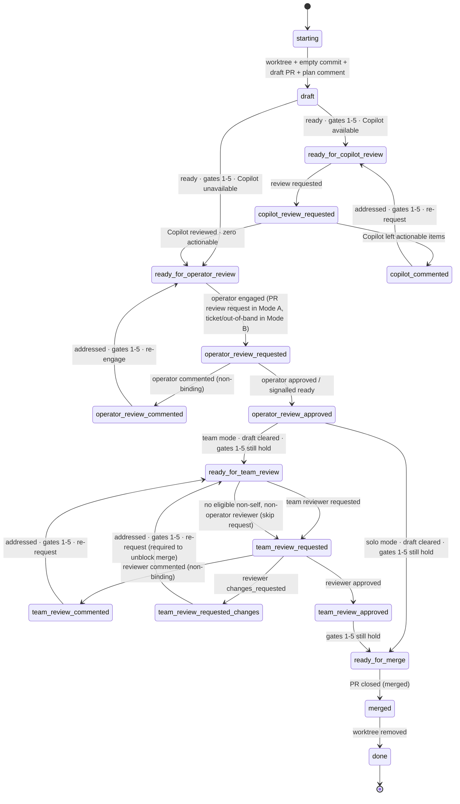

# deliver

Land a code change via a PR. On every tick: run `scripts/pr-status`, address every actionable concern, then evaluate exit gates to decide whether to transition.

## Setup

1. **Worktree.** Work inside `<worktree_base>/<owner>/<repo>/<branch>` (`worktree_base` is a `userConfig` value; default `~/.worktrees`). Find existing with `git worktree list` — never guess. Reuse if present.
2. **PR-open sequence** (skip if a PR is already open for this branch):
   - `git commit --allow-empty -m "chore: open PR [skip ci]"` — never amend or squash this commit.
   - Push; open a **draft** PR. Body: Motivation, Ticket link (omit entirely if none — bare IDs are non-conforming), Test plan. **No execution plan in the body.**
   - Post the plan as a top-level PR comment. Include `<!-- agent-plan:<agent-id> -->` inside the §2.1 body (after the machine marker / sparkle line, not before). Pin if supported.
3. **Resuming.** If a PR already exists: reuse worktree, skip the open sequence, find the existing plan comment by its `agent-plan` marker. If missing, post one. Never open a second PR; never retroactively rewrite the body.

## Gates

Seven binary signals read from each `pr-status` XML:

1. **CI.** `<checks state="passing">`. The protocol's rollup already treats `neutral`/`success` as passing and lets the repo suppress specific non-blocking checks via `informational="true"`.
2. **No conflicts.** `<merge-conflicts present="false"/>`.
3. **No actionable annotations.** Zero `<annotation actionable="true">`.
4. **No actionable comments.** Zero `<comment actionable="true">`.
5. **No actionable threads.** Zero `<thread actionable="true">`.
6. **Operator-approved.** The operator has signalled approval — a formal approval review (Mode A), a `+1` reaction on the engagement comment, a "go ahead" reply, or an explicit "ready/clear draft" instruction. Required in both solo and team mode.
7. **Team-approved.** At least one `<review mode="human" state="approved">` from a non-self, non-operator reviewer, and no current `changes_requested` from any reviewer. Required only in team mode (`team_mode = true`); trivially satisfied in solo mode.

Gates 1–5 are evaluated at every tick across every lifecycle state outside `starting`/`done`. **Gate failures are addressed in place — they do not change the state.** Only the conditions listed on each transition edge below trigger a state change.

## Solo vs team mode

The `team_mode` config flag selects which downstream stages exist:

- **Solo mode** (`team_mode = false`, default). The operator is the sole human reviewer. The lifecycle is `… → operator_review_approved → ready_for_merge → merged → done`. No `team_*` states are reachable. Gate 7 is trivially satisfied.
- **Team mode** (`team_mode = true`). The operator gets a private pass while the PR is still in draft. After operator approval the agent clears draft and engages additional reviewers. Gate 7 must be satisfied before `ready_for_merge`.

In **both** modes the operator-review stage runs in draft. Draft is never cleared before operator approval. The operator MAY clear draft themselves; in that case the agent observes the cleared state and treats it as equivalent to operator approval.

## Lifecycle



Universal terminal (not drawn, applies from every state): **PR closed (merged or not)** or **operator "stop" instruction** → acknowledge per §2.1 → `merged` → `done`. This includes the sole-reviewer case (team mode, no eligible non-self non-operator reviewer), where the explicit `team_review_approved → ready_for_merge → merged` path is unreachable and the merge fires the universal edge directly out of `team_review_requested`. Worktree cleanup happens on **any** closure.

## States

| State                          | Do                                                                                                                                            | Poll?    |
| ------------------------------ | --------------------------------------------------------------------------------------------------------------------------------------------- | -------- |
| `starting`                     | Create or locate the worktree (§Setup).                                                                                                       | no       |
| `draft`                        | **Coding happens here.** Edit; pre-push review; push. When ready, check gates 1–5.                                                            | no       |
| `ready_for_copilot_review`     | Request Copilot review.                                                                                                                       | no       |
| `copilot_review_requested`     | Await Copilot's review.                                                                                                                       | CI       |
| `copilot_commented`            | Address each actionable Copilot item; push fix(es).                                                                                           | no       |
| `ready_for_operator_review`    | Engage the operator (Mode A: PR review request on the draft. Mode B: ticket comment, then out-of-band). PR stays in draft. Never self-engage. | no       |
| `operator_review_requested`    | Await the operator's response.                                                                                                                | reviewer |
| `operator_review_commented`    | Address each item; push; re-engage the operator. PR stays in draft.                                                                           | no       |
| `operator_review_approved`     | Confirm gates 1–5 still hold; clear draft (or observe the operator clearing it); transition per `team_mode`.                                  | no       |
| `ready_for_team_review`        | Request team reviewer(s) (team mode only). Never self-request; never request from the operator. Mode A/B per reference.                       | no       |
| `team_review_requested`        | Await a team reviewer's review.                                                                                                               | reviewer |
| `team_review_commented`        | Address each item; push; re-request review.                                                                                                   | no       |
| `team_review_requested_changes`| Address; push; **re-request required** — `changes_requested` blocks merge until cleared.                                                      | no       |
| `team_review_approved`         | Confirm gates 1–5 still hold; else fix in place.                                                                                              | no       |
| `ready_for_merge`              | Await merge. **Don't self-merge unless instructed.**                                                                                          | merge    |
| `merged`                       | Acknowledge (§2.1); remove any worktree you created.                                                                                          | no       |
| `done`                         | Terminal.                                                                                                                                     | —        |

**Coding does NOT happen in:** `ready_for_copilot_review`, `copilot_review_requested`, `ready_for_operator_review`, `operator_review_requested`, `operator_review_approved`, `ready_for_team_review`, `team_review_requested`, `team_review_approved`, `ready_for_merge`, `merged`, `done`. Code changes in those states are only legal as the response to a gate-1–5 failure (CI broke, conflict arose, a new actionable annotation/comment/thread appeared) — and that work is "addressing concerns in place," not advancing the lifecycle.

**Self as sole eligible reviewer.** In team mode, if no eligible non-self, non-operator human reviewer exists, `ready_for_team_review` skips the request but still transitions to `team_review_requested` and keeps polling on the reviewer cadence. Gate 7 is unreachable in this case, which is fine — the PR is merged out-of-band, the agent observes closure on a poll, and the universal `merged → done` terminal fires. "Nobody to request from" is not a termination condition.

## Per-concern handling

Apply to every actionable item the XML emits, not just the first.

| XML signal                                            | Action                                                                                                                                                             |
| ----------------------------------------------------- | ------------------------------------------------------------------------------------------------------------------------------------------------------------------ |
| `<merge-conflicts present="true"/>` (gate 2 fails)    | Rebase or merge the target branch; resolve.                                                                                                                        |
| `<checks state="failing">` (gate 1 fails)             | Diagnose root cause; fix.                                                                                                                                          |
| Actionable `<comment>` or `<thread>` (gates 4–5 fail) | Reply per §2.1 with **either** a commit link describing what changed **or** a one-line dismissal rationale. Apply terminal signal. Resolve threads when satisfied. |
| Actionable `<annotation>` (gate 3 fails)              | Fix the code, OR dismiss by writing `<cache>/$id.ack` with the rationale captured in the plan comment or commit body.                                              |

## Cross-cutting behaviors

These apply in every state; they are not states themselves.

- **Pre-push review.** Before every significant push: simplify pass + adversarial pass by a distinct reviewer. Triage every finding (act or one-line dismissal). Non-significant pushes (the empty `chore: open PR`, whitespace/format-only, trivial typo/lint fixes) skip pre-push review; if unsure, treat as significant.
- **Reply to every reviewer item.** Commit link or dismissal rationale. Silence is non-conforming. Human comments get more deference than bot ones; operator comments get more deference than any other reviewer's.
- **Plan comment is the living plan.** Edit in place: check off completed steps, strike through abandoned ones with a one-line rationale (don't delete), append new ones. The PR body's Motivation and Test plan stay stable.
- **First green.** Gate 1 must be satisfied by a green CI rollup achieved _after_ the agent first attempts to leave `draft` (i.e. reaches `ready_for_copilot_review` or `ready_for_operator_review`). Greens on intermediate commits before that moment do not satisfy gate 1.
- **Heartbeats.** While polling, emit INFO heartbeats per §2.3 (`ticket=-` when there is no linked ticket).
- **Termination is narrow.** Plan completion, green CI, review requests, `ready_for_merge`, and "nobody to request review from" do not terminate. Only PR closure or an explicit operator "stop" terminates. The agent runs the lifecycle through itself — see §Polling/Mechanism — and is never re-prodded by a caller (operator or orchestrator) to make forward progress.
- **Re-derive termination each tick.** Decide termination from the current `pr-status` read; never carry "if X then stop" conditions across ticks. The loop amplifies them, and only the narrow list above is grounds for stopping.

## Polling

Adaptive, not fixed. Build project memory and use it to dodge unnecessary traffic. **Never poll faster than once per minute.**

| Waiting on                             | Schedule                                                                                 |
| -------------------------------------- | ---------------------------------------------------------------------------------------- |
| CI (`<checks state="pending">`)        | 60 s. Lengthen to ~5 min once past the project's typical CI duration without completion. |
| Reviewer reply after a request         | 5 min for the first hour; then 30 min.                                                   |
| Merge after reaching `ready_for_merge` | 5 min for the first hour; then 30 min.                                                   |

### Mechanism

The agent is the poll loop. Polling is done by the agent itself, inline, via sequential foreground tool calls — typically `Bash` `sleep` followed by a `pr-status` re-read and any reactive work the new state requires. The agent stays continuously active in its current turn until a lifecycle terminal (see "Termination is narrow"); it does not yield its turn back to a caller, hand off to a wakeup, or expect anyone to re-prod it. This holds whether `deliver` is invoked directly by the operator or dispatched as a subagent (e.g. `linear-project`'s `deliver-worker`).

For waits longer than the Bash tool timeout (~10 min), do **not** use a single long `sleep`. Split into shorter intervals — a 30-minute reviewer wait becomes ~5×6-minute `sleep`s, each followed by a cheap `pr-status` check. Re-checking more often than the schedule above is fine; the table is an upper bound on the wait, not a lower bound on the loop.

Forbidden patterns (each has been observed to silently strand a PR mid-lifecycle):

- **Detached background poll loops.** Any `run_in_background: true` Bash whose body repeats `touch <lock>; sleep; poll` in any form — `while true`, `until`, plain `touch; sleep; touch` triplets, `nohup`, `disown`, etc. Spawning a detached loop and then exhausting the agent's tool calls leaves the OS process polling indefinitely while the agent itself is reaped; the lock keeps heartbeating forever even though no reactive work can happen, and the PR sits orphaned with the `agent-working` signal still set.
- **Suspending on `Monitor`** as the poll vehicle. The harness's armed-monitor pattern observably fails to wake long polls — the agent yields, the wake never fires, the PR is silently unmonitored. Stay in-turn with foreground `sleep`s instead.
- **Ending the turn before a lifecycle terminal.** Returning early — for "no actionable work right now," for "the caller will check back," or any reason short of merged / closed / explicit operator "stop" — orphans the PR. The corresponding instruction to a caller is: **do not design the caller around mid-lifecycle re-dispatch.** A live `deliver` agent is expected to be doing the work.

When the agent reaches a lifecycle terminal, or exits in response to an explicit operator "stop" it can catch, it runs whatever cleanup the dispatch brief specifies (lock file removal, `agent-working` label removal, status file write). Abnormal exits (API errors, OOM, harness reaping) are out of the agent's reach; the caller's stale-state sweep is the backstop for those, not a substitute for the agent's discipline.

### Project memory

Maintain a small history file at `<cache-base>/<skill>/<repo-slug>/_history.jsonl`. On every observed wait, append one line:

```json
{ "ts": "...", "kind": "ci|reviewer|merge", "elapsed_s": 0, "outcome": "..." }
```

On entry to a polling state, read the median `elapsed_s` for that kind and tune the schedule above: shorten the head when CI is typically fast; lengthen the tail when reviewers are typically slow. Cap the history at the most recent ~100 entries per kind.

## Configuration

Read from the plugin's `userConfig` (env: `CLAUDE_PLUGIN_OPTION_*`):

| Key                 | Effect                                                                                                                                                                                            |
| ------------------- | ------------------------------------------------------------------------------------------------------------------------------------------------------------------------------------------------- |
| `copilot_available` | `false` → skip the Copilot phase entirely: `draft → ready_for_operator_review` directly. Default `true`.                                                                                          |
| `worktree_base`     | Root directory for per-PR worktrees. Layout: `<base>/<owner>/<repo>/<branch>`. Default `~/.worktrees`.                                                                                            |
| `team_mode`         | `true` → add the team-review stage after operator approval (`team_*` states reachable; Gate 7 required). `false` → solo: `operator_review_approved → ready_for_merge` directly. Default `false`. |

## References

The bits this skill leans on — Mode A/B detection, the machine marker and
sparkle wrapper, terminal signals, actionability, and the operational-log line
format — are condensed in [`reference.md`](./reference.md), bundled so the skill
is self-contained once installed. That file points back to the full dispatch
spec (§2.1 Communication, §2.2 PR Status, §2.3 Logging, §2.4 Delivery) where the
two differ.
