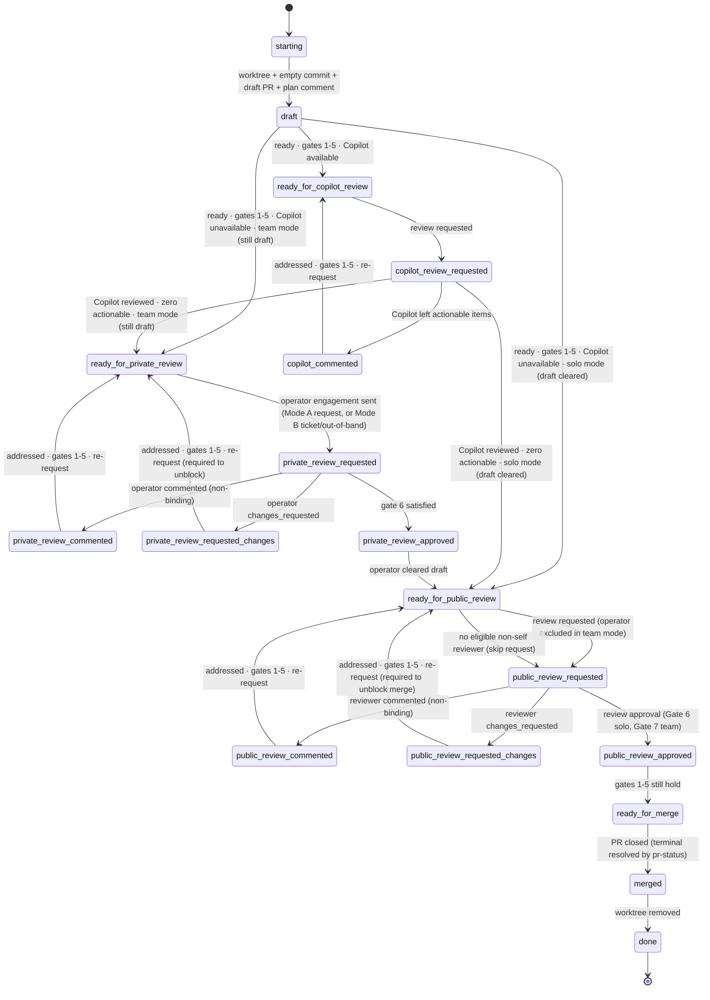

# deliver

Land a code change via a PR. Each tick: run `scripts/pr-status`, address every
actionable concern, then evaluate the gates to decide whether to transition.

**Operator** = the one human directing this agent; the only human with stop
authority. Role glossary in [`reference.md`](./reference.md#roles-1).

**Running `pr-status`.** Run `scripts/pr-status <pr>`.

## Setup

1. **Worktree.** Work in `${user_config.worktree_base}/<owner>/<repo>/<branch>`.
   Locate via `git worktree list` — never guess. Reuse if present.
2. **Open PR** (skip if one already exists for the branch):
   - `git commit --allow-empty -m "chore: open PR [skip ci]"` — never amend or
     squash this commit.
   - Push; open a **draft** PR. Body: Motivation, Ticket link (omit if none —
     no bare IDs), Test plan. **No execution plan in the body.**
   - Post the plan as a top-level comment with `<!-- agent-plan:<agent-id> -->`
     inside the wire-format body (after the marker/sparkle, not as the first
     line; see [`reference.md`](./reference.md#wire-format)). Pin if supported.
3. **Resume.** PR exists → reuse worktree, skip the open sequence, find the plan
   comment by its `agent-plan` marker (post one if missing). Never open a second
   PR or rewrite the body.

## Gates

Seven binary signals read from each `pr-status` XML:

1. **CI** — `<checks state="passing">` (rollup treats neutral/success as
   passing; repo can suppress non-blocking checks via `informational="true"`).
2. **No conflicts** — `<merge-conflicts present="false"/>`.
3. **No actionable annotations** — zero `<annotation actionable="true">`.
4. **No actionable comments** — zero `<comment actionable="true">`.
5. **No actionable threads** — zero `<thread actionable="true">`.
6. **Operator-approved** (always required). Any of:
   - `<review mode="human" role="operator" state="approved">` (Mode A), or
   - `<reaction emoji="+1">` from the operator on the engagement comment, or
   - a "go ahead"/"lgtm"/"ready" reply from the operator (on the
     engagement comment, the ticket, or out-of-band), or
   - a ticket-side approval (e.g. operator status transition).

   Satisfied during `private_review_*` (team) or `public_review_*` (solo).
7. **Team-approved** (team mode only). At least one `<review mode="human"
   role="team" state="approved">` from a non-self reviewer and no current
   `changes_requested`. Satisfied during `public_review_*`. Trivially satisfied
   in solo mode.

Gates 1–5 are evaluated every tick outside `starting`/`done`. **Gate failures
are fixed in place — they don't change state.** Only the conditions on a
transition edge change state.

## Lifecycle

States are named by **PR visibility**: `private_review_*` is while still draft
(team mode, operator audience); `public_review_*` is after draft clears
(operator in solo mode; team reviewers in team mode).



Copilot review is `${user_config.copilot_available}` on this install — when
`false`, take the `Copilot unavailable` edges and skip the `copilot_*` states
entirely.

`private_review_*` is unreachable in solo mode. **Who clears draft depends on
mode.** In solo mode the agent clears draft on the edge into
`ready_for_public_review` (out of `copilot_review_requested`, or `draft` when
Copilot is unavailable). In team mode the agent **never** clears draft — the
operator moves the PR from draft to ready themselves; the agent observes the PR
is no longer a draft and proceeds into `ready_for_public_review`. (In solo mode,
if the operator clears draft first, the agent likewise just proceeds.)

**Universal terminal** (from any state): PR closed, or operator "stop" → read
`<terminal>` from `pr-status` → acknowledge with a terminal signal → `merged` →
`done`. `<terminal state>` is binary — *did the change ship*, not *how*:

- **`shipped`** — change present in base (merged, fast-forward, or squash/rebase
  by external tooling). Acknowledge delivered (`Shipped.`/`rocket`). For a
  linked ticket, advance to delivered/verified **only if this PR completes the
  ticket** (a multi-PR ticket must not be marked `delivered` until every
  required PR lands); otherwise just record the shipped PR.
- **`abandoned`** — closed with change absent. Acknowledge not-delivered, don't
  advance the ticket. Surface any `error=` breadcrumb — never claim delivery on
  a guess.

This covers the team-mode sole-reviewer case (merge fires this edge directly out
of `public_review_requested`). Worktree cleanup happens on any closure.

## States

| State                              | Do                                                                                                              | Poll?    |
| ---------------------------------- | --------------------------------------------------------------------------------------------------------------- | -------- |
| `starting`                         | Create or locate the worktree (see Setup).                                                                      | no       |
| `draft`                            | **Coding happens here.** Edit; pre-push review; push. When ready, check gates 1–5.                              | no       |
| `ready_for_copilot_review`         | Request Copilot review.                                                                                         | no       |
| `copilot_review_requested`         | Await Copilot's review.                                                                                         | CI       |
| `copilot_commented`                | Address each actionable Copilot item; push fix(es).                                                             | no       |
| `ready_for_private_review`         | (Team.) Engage the operator while in draft: post the engagement comment (agent-reply marker + `<!-- agent-engagement:<agent-id> -->` sentinel) and notify — Mode A: PR review request to `operator_login`; Mode B: ticket/out-of-band ([reference.md](./reference.md#review-rules)). | no       |
| `private_review_requested`         | (Team.) Await the operator's signal.                                                                            | reviewer |
| `private_review_commented`         | (Team.) Address each item; push; re-request.                                                                    | no       |
| `private_review_requested_changes` | (Team.) Address; push; **re-request required** — blocks public review.                                          | no       |
| `private_review_approved`          | (Team.) **Don't clear draft** — the operator does. Poll until the PR is no longer a draft, then → `ready_for_public_review`. | reviewer |
| `ready_for_public_review`          | Request public review. Solo: post the engagement comment (agent-reply + `agent-engagement` sentinel) and engage the operator. Team: request team reviewer(s), **excluding the operator**. Never self-request. Mode A/B per reference. | no       |
| `public_review_requested`          | Await the public reviewer.                                                                                      | reviewer |
| `public_review_commented`          | Address each item; push; re-request.                                                                            | no       |
| `public_review_requested_changes`  | Address; push; **re-request required** — blocks merge.                                                          | no       |
| `public_review_approved`           | Confirm gates 1–5 still hold; else fix in place.                                                                | no       |
| `ready_for_merge`                  | Await merge. **Don't self-merge unless instructed.**                                                            | merge    |
| `merged`                           | Read `<terminal>`. **shipped** → acknowledge delivered; advance a linked ticket only if this PR completes it. **abandoned** → acknowledge not-delivered, leave the ticket (surface any `error=`). Either way, remove any worktree you created. | no       |
| `done`                             | Terminal.                                                                                                       | —        |

**Coding only happens in `draft`** — and in any other state only as the fix to a
gate-1–5 failure (CI broke, conflict, new actionable item). That fix is
"addressing concerns in place," not advancing the lifecycle.

### Solo vs team mode

**`team_mode` is `${user_config.team_mode}` — never infer it.** Mode picks which states are
reachable and who clears draft (the agent in solo, the operator in team).

- **Solo** (default). Operator is the only human reviewer. After Copilot, the
  agent clears draft and engages the operator as the public reviewer.
  `private_review_*` unreachable. Gate 6 satisfied during `public_review_*`;
  Gate 7 trivial.
- **Team.** Operator gets a private pre-review while still draft. After the
  operator approves (Gate 6 during `private_review_*`), the operator — **not**
  the agent — clears draft (moves the PR to ready); the agent observes it's
  non-draft and engages the rest of the team (Gate 7 during `public_review_*`).
  Operator is **excluded** from the public reviewer set.

  *Early clear.* If the operator clears draft **before** Gate 6 is satisfied,
  draft-clear alone is not approval — stay in `private_review_*` and keep
  awaiting the operator's Gate 6 signal (re-engage if needed). Advance to
  `ready_for_public_review` only once Gate 6 holds; the draft is already clear.

**No eligible reviewer.** If no non-self human reviewer exists in
`ready_for_public_review`, skip the request but still transition to
`public_review_requested` and keep polling on the reviewer cadence. Solo: the
operator is still the binding reviewer (Gate 6 via non-formal signals). Team: if
no non-self, non-operator reviewer exists, Gate 7 is unreachable — the PR merges
out-of-band, the agent observes closure on a poll, `merged → done` fires.
"Nobody to ask" never terminates.

## Per-concern handling

Apply to **every** actionable item, not just the first.

| XML signal                                            | Action                                                                    |
| ----------------------------------------------------- | ------------------------------------------------------------------------- |
| `<merge-conflicts present="true"/>` (gate 2)          | Rebase or merge the target branch; resolve.                               |
| `<checks state="failing">` (gate 1)                   | Diagnose root cause; fix.                                                 |
| Actionable `<comment>` or `<thread>` (gates 4–5)      | Reply (commit link **or** one-line dismissal naming what's dismissed) and apply a terminal signal. **Never resolve the thread** — even your own; that's a human's call, and the terminal signal already suppresses re-evaluation. |
| Actionable `<annotation>` (gate 3)                    | Fix the code, OR dismiss with a `<cache>/$id.ack` carrying the rationale (also record it in the plan comment or commit body). |

## Cross-cutting behaviors

Apply in every state.

- **Read PR state only through `pr-status`.** Every gate and actionability
  decision comes from a `pr-status` XML snapshot and the cache it wrote — never
  `gh pr view`, `gh pr checks`, `gh api …/comments|/reviews`, or MCP PR reads.
  For full text, read the cache file `pr-status` already wrote. You may directly
  fetch *emergent* data the snapshot doesn't cover, but routine `gh`/MCP calls
  are *writes only* (reply, request review, mark ready, react — never resolve
  threads). A review still being *drafted* (unsubmitted) is invisible by design;
  don't chase it — wait for `pr-status` to surface it.
- **`actionable` is the sole task source.** Drive every decision off
  `actionable="true|false"`. A non-actionable item also carries `reason=`
  (`resolved`, `agent-artifact`, `agent-terminal-reply`, `acked`). A `<summary>`
  is a **reading aid, not a work queue**: read it plus the new cache content when
  an item is actionable; ignore it as context when not. A summary describes the
  item's *content*, not its *resolution*, so an item you already terminal-tagged
  reads as if the point still stands — expected. Never let summary prose
  re-actionable a suppressed item.
- **A `pending` review is in-flight, not absent.** Each reviewer appears once
  under `<reviews>` walking `pending → commented | changes_requested |
  approved`. An outstanding request overrides a prior verdict back to `pending`
  (re-requested Copilot/operator). While any reviewer is `pending` — especially
  a `mode="bot"` one — inline threads can still land minutes later, so a stable
  thread set is **not** convergence. Keep polling until `pending` clears.
- **Pre-push review.** Before every significant push, run two adversarial
  passes:
  1. *Spec-aware* — spec/docs + PR contents: find every drift from the spec
     (missing, extra, or conflicting behavior).
  2. *Spec-blind* — PR contents only: find every bug, inconsistency, or
     claim-vs-implementation gap (judged against the PR's own commit
     messages/identifiers/comments).

  Use a **model family distinct from the authoring one** for both passes where
  the install has one (e.g. Codex `codex:adversarial-review`/`codex:rescue` when
  Claude authored). A second subagent on the authoring model does NOT count.
  Only where no distinct family exists may both fall back to authoring-model
  subagents (weaker — extra caution). Triage every finding (act, or one-line
  dismissal naming it). Skip pre-push review only for non-significant pushes
  (the empty open commit, whitespace/format-only, trivial typo/lint); if unsure,
  treat as significant.
- **Reply to every reviewer item** — commit link or dismissal rationale.
  Silence is non-conforming. Humans get more deference than bots.
- **Plan comment is the living plan.** Edit in place: check off done steps,
  strike abandoned ones with a one-line rationale (don't delete), append new
  ones. The PR body's Motivation/Test plan stay stable.
- **First green.** Gate 1 needs a green rollup achieved *after* the agent first
  attempts to leave `draft`. Earlier greens don't count.
- **Heartbeats.** Inline loop: emit INFO heartbeats while polling. Event-driven
  mode: one per wake — silence between wakes is by design. (See
  [`reference.md`](./reference.md#operational-logging); `ticket=-` when none.)
- **Termination is narrow.** Only PR closure or explicit operator "stop"
  terminates. Plan completion, green CI, review requests, `ready_for_merge`, and
  "nobody to ask" do not. The agent runs the loop through itself (see Polling)
  and is never re-prodded *by the caller* — wakeups the agent armed itself
  (event-driven mode) are part of the loop, not re-prodding.
- **Re-derive termination each tick** from the current `pr-status`. Never carry
  "if X then stop" across ticks — the loop amplifies them.

## Polling

Adaptive, not fixed. Build project memory to dodge needless traffic. **Never
poll faster than once per minute.**

| Waiting on                      | Schedule                                                              |
| ------------------------------- | --------------------------------------------------------------------- |
| CI (`<checks state="pending">`) | 60 s; lengthen to ~5 min once past the project's typical CI duration. |
| Reviewer reply after a request  | 5 min for the first hour; then 30 min.                                |
| Operator to clear draft (team)  | 5 min for the first hour; then 30 min.                                |
| Merge after `ready_for_merge`   | 5 min for the first hour; then 30 min.                                |

### Mode selection

The waiting *mechanism* depends on two axes — execution environment and
invocation context:

| Environment    | Main agent                                                  | Subagent                                  |
| -------------- | ----------------------------------------------------------- | ----------------------------------------- |
| Local CLI      | Inline loop; bounded waits via foreground `sleep`           | Same as local main                        |
| Remote sandbox | Event-driven; degrade to inline loop with `Monitor` waits   | Inline loop; bounded waits via `Monitor`  |

Resolve the cell once at entry and record it in the wait-state file:

1. **Invocation** — read `agent_context=main|subagent` from the dispatch brief.
   Standalone `/deliver` → `main`. Absent or unknown → `subagent` (the inline
   loop never yields, so it is safe everywhere).
2. **Environment** — probe `Bash` `sleep 1`. Succeeds → local. Blocked (remote
   sandboxes block foreground `sleep`, subagents included) → remote.
3. **Remote main** — `send_later` (claude-code-remote MCP) available →
   event-driven; also `subscribe_pr_activity` when present. No `send_later` →
   inline loop with bounded `Monitor` waits.

### Bounded wait

One wait tick of **≤ ~10 min**, after which control returns to the agent:

- **Local** — foreground `Bash` `sleep N`.
- **Remote** — arm `Monitor` with a pure wall-clock deadline ≤ 10 min out (an
  until-loop on the clock, never on the awaited outcome); treat the wake
  exactly like `sleep` returning.

Schedule entries past 10 min split into ticks (a 30-min wait ≈ 5×6-min ticks,
each followed by a cheap `pr-status` check). Re-checking more often than the
schedule is fine; the table is an upper bound.

A bounded wait is **not a yield**. *Yield* = ending the turn. The rule:
subagents and inline-mode main agents never yield before a lifecycle terminal;
an event-driven main agent yields only with a confirmed armed check-in recorded
in wait-state.

### Inline loop

The agent **is** the poll loop — inline, sequential foreground tool calls (a
bounded wait, then a `pr-status` re-read and any reactive work). Stay
continuously active in the current turn until a lifecycle terminal; never yield
the turn or expect re-prodding. This is the **only** conforming mechanism for
subagents — webhook events and scheduled wakeups land in the main transcript,
never in a subagent — and for any main agent outside event-driven mode.

### Event-driven waiting

Remote main agents only. The session can be woken between turns, so long waits
need not burn the loop:

- **Subscribe** on entry/resume: `subscribe_pr_activity` for the PR when the
  tool exists. Webhooks deliver comments, reviews, and CI *failures* — **not**
  CI success, new pushes, or merge-conflict transitions. The armed check-in
  therefore carries termination detection; the subscription only lowers
  reactive latency and is required only where the tool exists.
- **End of each tick** — exactly one of: more work now → keep going; expected
  wait **short** (under one bounded tick, by `_history.jsonl` median — e.g.
  fast CI) → take an inline bounded wait, don't yield; expected wait **long** →
  arm a `send_later` check-in at the adaptive-schedule interval, log `WAIT`
  naming `next_wakeup_at`, write wait-state, end the turn.
- **Never yield on an unconfirmed arm.** If `send_later` errors, retry once,
  then run the remainder of the lifecycle as an inline loop.
- **On wake** (webhook or check-in): log the wake heartbeat (`INFO`; `RESUME`
  only when the awaited condition has actually arrived), re-read
  `pr-status`, do the reactive work, then apply the end-of-tick rule above
  (which may re-arm and yield, or keep going inline). Ticks are idempotent;
  duplicate or stale wakes are cheap no-ops. Track exactly one logical
  `next_wakeup_at` (cancel-and-replace where supported).
- **Terminal**: best-effort unsubscribe, stop re-arming, clear wait-state, run
  cleanup. A leaked subscription only produces no-op post-terminal ticks that
  re-attempt the unsubscribe.
- An out-of-band operator "stop" is observed at the next wake — latency bounded
  by `next_wakeup_at`. Known property, by design; a stop posted on the PR wakes
  the session via webhook.

### Wait state

Maintain `<cache-base>/<skill>/<repo-slug>/<pr-number>/wait-state.json`:

```json
{ "agent_id": "...", "pr_url": "...", "lifecycle_state": "...", "mode": "inline|event", "subscription_active": false, "next_wakeup_at": "...", "updated_at": "..." }
```

Write it at entry, on every lifecycle transition, and before every yield; clear
it at terminal. In inline mode, `next_wakeup_at` is the end of the current
bounded wait — refresh it before each wait tick. Callers judge staleness by
`now > next_wakeup_at + grace` — never by fixed heartbeat age (an event-mode
agent is silent between wakes by design); the predicate covers both modes.

### Forbidden

Each has stranded a PR:

- **Detached background poll loops** — any `run_in_background` Bash repeating
  `touch <lock>; sleep; poll` (`while`, `until`, `nohup`, `disown`, …). The OS
  process polls forever while the agent is reaped; the PR sits orphaned. A
  background process's exit does not reliably wake the agent — it is never a
  waiting vehicle.
- **Long-armed `Monitor`** — armed past ~10 min, or with the awaited outcome as
  its condition ("until CI green"): the wake observably fails on long polls.
  Only bounded wall-clock deadlines, re-armed each tick (see Bounded wait).
- **Yielding without a wakeup** — subagents and inline-mode mains never end the
  turn before a lifecycle terminal; an event-driven main never ends it without
  a confirmed armed check-in in wait-state. "No work right now" or "the caller
  will check back" orphans the PR; don't design a caller around mid-lifecycle
  re-dispatch.

At a lifecycle terminal (or a caught operator "stop") run whatever cleanup the
dispatch brief specifies (lock removal, `agent-working` label removal, status
write). Abnormal exits (API errors, OOM, reaping) are the caller's stale-state
sweep's job, not a substitute for this discipline.

### Project memory

Maintain `<cache-base>/<skill>/<repo-slug>/_history.jsonl`. On every observed
wait, append one line:

```json
{ "ts": "...", "kind": "ci|reviewer|merge", "elapsed_s": 0, "outcome": "..." }
```

On entry to a polling state, read the median `elapsed_s` for that kind and tune
the schedule (shorten the head for fast CI; lengthen the tail for slow
reviewers). The same medians size event-mode check-in intervals and the
short/long yield threshold. Cap at ~100 entries per kind.

## References

Mode A/B detection, the machine marker + sparkle wrapper, terminal signals,
actionability, and the log-line format live in
[`reference.md`](./reference.md).
