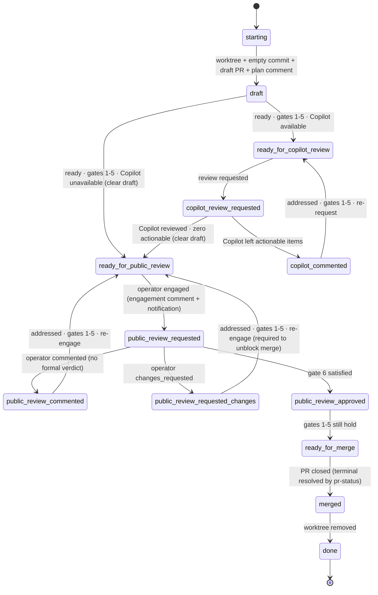

# land — solo operator mode

The operator is the only human in the loop: after Copilot review (where
available), the agent clears draft and engages the operator as the public
reviewer.

## Gates 6–7 in solo

- **Gate 6 (operator-approved)** is satisfied during `public_review_*`.
- **Gate 7** — there is no second approver in this mode. Never evaluated.

## Draft clearing

The agent clears draft on the edge into `ready_for_public_review`. If the
operator clears draft first, just proceed.

## Lifecycle

## States

| State                             | Do                                                                                                              | Poll?    |
| --------------------------------- | --------------------------------------------------------------------------------------------------------------- | -------- |
| `starting`                        | Create or locate the worktree (see Setup in `SKILL.md`).                                                        | no       |
| `draft`                           | **Coding happens here.** Edit; pre-push review; push. When ready, check gates 1–5.                              | no       |
| `ready_for_copilot_review`        | Request Copilot review.                                                                                         | no       |
| `copilot_review_requested`        | Await Copilot's review.                                                                                         | CI       |
| `copilot_commented`               | Address each actionable Copilot item; push fix(es).                                                             | no       |
| `ready_for_public_review`         | Clear draft (if still draft). Post the engagement comment (agent-reply marker + `<!-- agent-engagement:<agent-id> -->` sentinel) and notify the operator via your credentials file's venue. Never self-request. | no       |
| `public_review_requested`         | Await the operator's signal.                                                                                    | reviewer |
| `public_review_commented`         | Address each item; push; re-engage.                                                                             | no       |
| `public_review_requested_changes` | Address; push; **re-engage required** — blocks merge.                                                           | no       |
| `public_review_approved`          | Confirm gates 1–5 still hold; else fix in place.                                                                | no       |
| `ready_for_merge`                 | Await merge. **Don't self-merge unless instructed.**                                                            | merge    |
| `merged`                          | Handle per **Ending the run** in `SKILL.md`.                                                                    | no       |
| `done`                            | Terminal.                                                                                                       | —        |

## No formal review

A formal review may never arrive — whether one is even possible is your
credentials file's concern. The engagement comment anchors the reaction- and
reply-based Gate 6 signals; keep polling on the reviewer cadence. "Nobody to
ask" never terminates.
