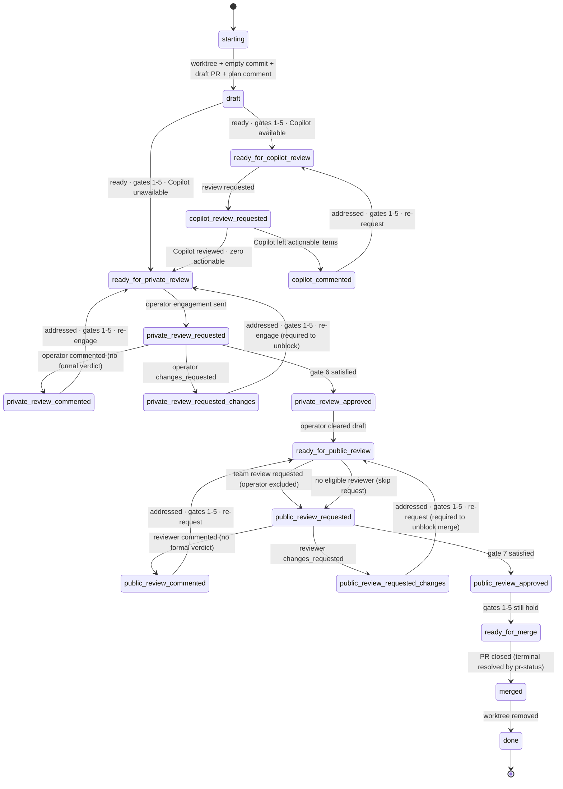

# deliver — team operator mode

The operator directs the agent but is one of several humans
(`operator_mode: team`). Review happens in two stages. First the operator
reviews alone, while the PR is still a draft. Then the operator — never the
agent — clears draft, and the rest of the team reviews, with the operator
**excluded** from that second set. The team stage is a plain review request,
not an engagement.

## Gates 6–7 in team

- **Gate 6 (operator-approved)** is satisfied during `private_review_*`.
- **Gate 7 (team-approved)** is satisfied during `public_review_*`: at least
  one `<review mode="human" role="team" state="approved">` from a non-self,
  non-operator reviewer and no current `changes_requested`.

## Draft clearing

The agent **never** clears draft. After Gate 6, poll until the PR is no longer
a draft (reviewer cadence), then proceed to `ready_for_public_review`.

*Early clear.* If the operator clears draft **before** Gate 6 is satisfied,
draft-clear alone is not approval — stay in `private_review_*` and keep
awaiting the operator's Gate 6 signal (re-engage if needed). Advance only once
Gate 6 holds; the draft is already clear.

## Lifecycle

## States

| State                              | Do                                                                                                              | Poll?    |
| ---------------------------------- | --------------------------------------------------------------------------------------------------------------- | -------- |
| `starting`                         | Create or locate the worktree (see Setup in `SKILL.md`).                                                        | no       |
| `draft`                            | **Coding happens here.** Edit; pre-push review; push. When ready, check gates 1–5.                              | no       |
| `ready_for_copilot_review`         | Request Copilot review.                                                                                         | no       |
| `copilot_review_requested`         | Await Copilot's review.                                                                                         | CI       |
| `copilot_commented`                | Address each actionable Copilot item; push fix(es).                                                             | no       |
| `ready_for_private_review`         | Engage the operator while in draft: post the engagement comment (agent-reply marker + `<!-- agent-engagement:<agent-id> -->` sentinel) and notify via your credentials file's venue. | no       |
| `private_review_requested`         | Await the operator's signal.                                                                                    | reviewer |
| `private_review_commented`         | Address each item; push; re-engage.                                                                            | no       |
| `private_review_requested_changes` | Address; push; **re-engage required** — blocks public review.                                                  | no       |
| `private_review_approved`          | **Don't clear draft** — the operator does. Poll until the PR is no longer a draft, then → `ready_for_public_review`. | reviewer |
| `ready_for_public_review`          | Request review from team reviewer(s), **excluding the operator**. Never self-request.                           | no       |
| `public_review_requested`          | Await the public reviewer.                                                                                      | reviewer |
| `public_review_commented`          | Address each item; push; re-request.                                                                            | no       |
| `public_review_requested_changes`  | Address; push; **re-request required** — blocks merge.                                                          | no       |
| `public_review_approved`           | Confirm gates 1–5 still hold; else fix in place.                                                                | no       |
| `ready_for_merge`                  | Await merge. **Don't self-merge unless instructed.**                                                            | merge    |
| `merged`                           | Handle per **Ending the run** in `SKILL.md`.                                                                    | no       |
| `done`                             | Terminal.                                                                                                       | —        |

## No eligible reviewer

If no non-self, non-operator reviewer exists in `ready_for_public_review`,
skip the request but still transition to `public_review_requested` and keep
polling on the reviewer cadence. Gate 7 is then unreachable — the PR merges
out-of-band, the agent observes closure on a poll, and `merged → done` fires.
This is also the sole-reviewer case: the operator approves privately, clears
draft, and merges themselves; merge fires the universal-terminal edge straight
out of `public_review_requested`. "Nobody to ask" never terminates.
